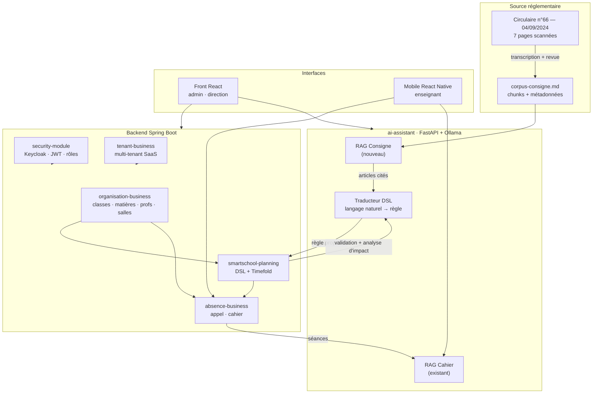

# Plan de recentrage du PFE — SmartSchool

> **Contexte.** L'encadreur académique juge le projet trop large et trop
> « classique » : beaucoup de modules CRUD, peu de profondeur scientifique. La
> réponse n'est pas d'ajouter, c'est de **retirer la largeur pour financer une
> profondeur** : un RAG ancré sur la circulaire ministérielle qui régit
> réellement la construction des emplois du temps en Tunisie.
>
> **Fenêtre.** Rédigé le **vendredi 4 septembre 2026**. Gel du code
> **dimanche 6 septembre au soir**. Soutenance **lundi 7 septembre**.
> Trois jours pleins, pas quatre.

---

## 1. La décision de périmètre

### 1.1 Ce qu'on garde, et pourquoi c'est cohérent

Le projet réduit raconte **une seule histoire**, de bout en bout :

> Un document du ministère fixe des règles et des volumes horaires.
> La plateforme les rend **lisibles** (RAG), **exécutables** (DSL de
> contraintes), **appliquées** (solveur d'emploi du temps), puis **vérifiées
> sur le terrain** (appel et cahier de séance, avec recherche sémantique).

| Module | Rôle dans l'histoire | Statut |
|---|---|---|
| `security-module` | Socle : Keycloak, JWT, rôles, `TenantContext` | **Gardé, inchangé** |
| `tenant-business` | Socle SaaS multi-tenant : établissements, abonnements | **Gardé, inchangé** |
| `common-module` | Socle : `BaseEntity`, filtre Hibernate tenant, exceptions | **Gardé, allégé** (audit retiré) |
| `organisation-business` | Source de vérité académique : classes, matières, enseignants, salles, créneaux, programmes | **Gardé, dégraissé** (§3.2) |
| `smartschool-planning` | **Cœur scientifique** : DSL de contraintes + solveur Timefold | **Gardé, renforcé** (§4, §5) |
| `absence-business` | Vérification terrain : appel, justificatifs, cahier de séance | **Gardé** + mobile (§6) |
| `ai-assistant` (Python) | RAG cahier (existant) + **RAG consigne (nouveau)** + traduction DSL | **Gardé, étendu** (§4) |

### 1.2 Ce qu'on supprime, et l'argument à tenir devant le jury

| Module supprimé | Fichiers Java | Argument |
|---|---|---|
| `budget-business` | 41 | CRUD financier. Aucun lien avec l'emploi du temps ni avec la consigne. C'est un autre projet. |
| `pointage-business` | 34 | Pointage du **personnel**. Redondant avec l'absence **élève**, qui est celle que la consigne encadre. |
| `audit-business` | 17 | Journal technique. Ne se démontre pas, ne se soutient pas. |
| `notification-business` | 11 | Notifications persistées. La progression du solveur passe déjà par WebSocket (`SolverProgressWebSocketAdapter`), qui **ne dépend pas** de ce module. |

**Total retiré : 113 classes Java (99 dans les modules + 14 dans `smartschool-api`)
+ 2 schémas Liquibase inclus + 10 composants React.**

> **Formulation pour la soutenance** — ne jamais dire « je n'ai pas eu le
> temps ». Dire : *« Le périmètre initial couvrait la gestion administrative
> complète d'un établissement. Je l'ai volontairement resserré sur la chaîne
> réglementation → planification → exécution, parce que c'est la seule où
> le travail est autre chose que du CRUD. »*

### 1.3 Vérification faite : la suppression est mécanique

Aucun des quatre modules n'est importé par un module conservé. Tout le
couplage est localisé dans `smartschool-api` :

```
audit        → api/audit/AuditController.java
budget       → api/budget/*.java                       (5 fichiers)
pointage     → api/pointage/*.java + adapter/          (5 fichiers)
notification → api/notification/*.java
             + api/planning/adapter/SolverJobNotificationAdapter.java   ← seul point sensible
```

`SolverJobNotificationAdapter` publie une notification persistée à la fin d'un
job solveur. Il se supprime sans conséquence : la progression **temps réel**
est publiée par `SolverProgressWebSocketAdapter`, qui n'implémente que le port
`SolverProgressPublisher` du module planning.

---

## 2. Architecture cible



**Le point à défendre** : la flèche `RAGC → DSLT` est la contribution. Une
règle proposée par l'IA n'est pas inventée — elle est **dérivée d'un article
identifiable de la circulaire**, et affichée avec sa citation.

---

## 3. Suppressions — mode opératoire

### 3.1 Modules entiers (≈ 1 h 30)

Ordre impératif : backend d'abord (le compilateur signale les oublis), front
ensuite.

```bash
cd ~/pfe/schoolSys/backend

# 1. Les modules
rm -rf budget-business pointage-business audit-business notification-business

# 2. Le pom parent : retirer les 4 <module> correspondants
#    (garder security, common, tenant, organisation, smartschool-api,
#     smartschool-planning, absence)

# 3. smartschool-api/pom.xml : retirer les 4 <dependency>

# 4. Les contrôleurs et adaptateurs
rm -rf smartschool-api/src/main/java/tn/wtm/school/api/{audit,budget,pointage,notification}
rm -f  smartschool-api/src/main/java/tn/wtm/school/api/planning/adapter/SolverJobNotificationAdapter.java

# 5. Liquibase — smartschool-api/src/main/resources/db.changelog/db.changelog-master.yaml
#    supprimer les blocs « audit schema » et « notification schema »
#    (budget et pointage ont leur propre master, non inclus : rien à faire)

# 6. application.yml : supprimer le bloc app.audit (enabled / max-value-length /
#    excluded-entities)

mvn -o clean install -DskipTests    # doit passer
```

**Base de données.** Les tables `audit_log`, `notification`, `budget_*`,
`pointage_*` restent en base. Ne pas les supprimer à la main : recréer la base
de démo est plus sûr et plus rapide.

```bash
docker compose down -v && docker compose up -d      # repart d'une base propre
```

### 3.2 Dégraissage d'`organisation-business` (≈ 45 min)

`organisation-business` est le plus gros module (148 classes) mais **c'est la
source d'alimentation de `planning` et d'`absence`** — la marge est faible.
Vérifié : `planning` lit `Pattern`, `PatternDetail`, `Room`, `SchoolYear`,
`SubjectSessionType`, `Teacher`, `TeachingAssignment`, `TimeSlot`,
`DayPeriod`, `WeekParity` ; `absence` lit les élèves et le contexte scolaire.
Rien de tout cela ne peut partir.

Ce qui peut partir sans casser la chaîne :

| À retirer | Fichiers | Pourquoi |
|---|---|---|
| Import Excel / CSV | `util/ExcelImportHelper.java`, `EleveImportResult`, `TeacherImportResult`, `RoomImportResult` + les endpoints d'import + les boutons d'import du front | Fonction d'intégration, pas de fond. Le `DemoDataRunner` fournit déjà un jeu de données complet. Retire aussi 2 dépendances lourdes du pom (`poi-ooxml`, `commons-csv`). |
| Création en masse de classes | `BulkCreateClassGroupRequest`, `BulkCreateClassGroupResult` | Confort d'UI, pas une contribution. |

> **Décision assumée** : `NationalPattern` (programme officiel) **et** `Pattern`
> (programme adapté par l'établissement) sont **tous deux conservés** malgré la
> duplication apparente. C'est précisément le lien entre le document
> ministériel et le solveur : le tableau horaire de la page 5 de la circulaire
> **est** ce que `NationalPatternSeeder` injecte. Le supprimer couperait
> l'histoire en deux.

**Le vrai allègement d'`organisation` est côté interface**, pas côté code :
regrouper les 11 écrans en 4 onglets (`Structure` · `Ressources` ·
`Programmes` · `Comptes`) dans `AcademiqueDashboard.tsx`. Zéro risque
backend, effet immédiat sur la démonstration.

### 3.3 Front — ✅ FAIT (plus lourd que prévu)

**L'estimation de 45 min était fausse.** Les suppressions de fichiers ne
représentaient que la moitié du travail : **cinq tableaux de bord embarquaient
des widgets budget/pointage** et ont dû être retouchés à la main.

Fichiers supprimés :

```bash
rm -rf src/features/budget src/features/pointage
rm -f  src/features/rapports/JournalAudit.tsx
rm -f  src/features/enseignant/Notifications.tsx
rm -f  src/api/{budget,pointage,audit}.api.ts
```

Fichiers **retouchés** (le vrai travail) :

| Fichier | Ce qui a été retiré | Remplacement |
|---|---|---|
| `router/index.tsx` | 9 imports + 10 routes | — |
| `layout/Sidebar.tsx` | groupes « Pointage » et « Budget » (admin + surveillant), lien Audit, lien Notifications, 4 clés `CATEGORY_MAP`, 4 icônes | — |
| `layout/Topbar.tsx` | alertes budgétaires de la cloche | seules restent les alertes planning |
| `dashboard/DashboardEcole.tsx` | carte « Budget résumé » | grille passée de 3 à 2 colonnes |
| `dashboard/QuickActions.tsx` | 3 actions rapides | — |
| `statistiques/DashboardStatistiques.tsx` | 2 cartes domaine + 1 KPI + 2 requêtes | KPI « Plannings publiés » |
| `rapports/RapportsAnalyses.tsx` | **onglet « Finances » entier**, graphe présence personnel, 1 KPI | KPI « Enseignants en poste » |
| `surveillance/DashboardSurveillant.tsx` | 2 requêtes pointage, 1 KPI, encart justificatifs personnel | KPI « Appels encore ouverts » |
| `parametres/Parametres.tsx` | préférence « Alertes budgétaires » | — |
| `public/locales/{fr,ar,en}/translation.json` | 12 clés `nav.*` mortes × 3 langues | — |

> **Leçon à retenir pour la suite du plan** : un module « isolé » côté backend
> ne l'est pas côté front. Les tableaux de bord agrègent tout. Prévoir ce
> surcoût pour toute suppression ultérieure.

`tsc -b` a servi de filet exactement comme prévu : il a signalé les 4 derniers
imports morts (`Line`, `LineChart`, `DollarSign`, `today`).

### 3.4 Critère de fin d'étape

- [x] `mvn -o clean install` **vert** (7 modules)
- [x] `mvn -o test` **vert — 562 tests, 0 échec, 0 erreur, 9 ignorés**
      (tenant 19 · organisation 300 · planning 236 · absence 7)
- [x] `npm run build` **vert** · `oxlint` : 7 warnings préexistantes, 0 erreur
- [ ] `docker compose up -d` puis `mvn spring-boot:run -pl smartschool-api -Dspring-boot.run.profiles=demo` démarre sans erreur Liquibase
- [ ] Connexion, génération d'un emploi du temps, saisie d'un appel : OK

> **Base de données — à savoir avant de relancer.** Les tables `audit_log`,
> `notification`, `budget_*` et `pointage_*` existent toujours dans la base de
> développement. Liquibase ne s'en plaint pas (il ne valide que les changesets
> encore présents dans le master), donc l'application démarre. Pour repartir
> propre : `docker compose down -v && docker compose up -d`.

> **Sauvegarde.** Tout ce qui a été supprimé est archivé dans
> `backup-modules-supprimes.tgz` (244 fichiers) — le projet n'étant pas encore
> sous git au moment de l'opération. À reprendre depuis git dès le § 7.1 fait.

---

## 4. Le RAG « Consigne ministérielle » — la contribution

### 4.1 Le problème réel

`docs/consigne.pdf` — circulaire **n°66 du 4 septembre 2024**, ministère de
l'Éducation, direction de la pédagogie du cycle préparatoire et secondaire —
contient exactement ce dont un directeur a besoin pour bâtir ses emplois du
temps, et exactement ce qu'un logiciel ne sait pas lire :

**Pages 2-3 — recommandations (15 règles).** Extraits :

| # | Règle | Traduction en contrainte |
|---|---|---|
| I.2 | Emploi du temps élève : **6 h/jour maximum, 2 h minimum** par demi-journée (sauf éducation physique) | `CLASS_DAY` + `TOTAL_HOURS > 6` → `PENALIZE/HARD` |
| I.3 | **2 h de coupure** entre les séances du matin et de l'après-midi | `CLASS_DAY`, contrainte de pause |
| I.4 | Interdiction de changer de salle pour une même classe dans une demi-journée, sauf salles spécialisées | `LESSON`, stabilité de salle |
| I.5 | **Heures creuses interdites** dans l'emploi du temps des élèves | `CLASS_DAY`, compacité |
| II.2 | Enseignant : **6 h/jour max, 2 h min** par demi-journée, réparties équitablement | `TEACHER_DAY` + `TOTAL_HOURS > 6` |
| II.3 | **5 h consécutives** autorisées le vendredi et le samedi | `TEACHER_DAY`, exception jour |
| II.4 | **Alternance matin/après-midi** sur les 4 premiers jours de la semaine | `TEACHER_WEEK` |
| II.5 | Au moins **deux niveaux différents** par enseignant | `TEACHER_WEEK` |
| III.2 | **3/4 du volume** des matières fondamentales (arabe, français, maths) le **matin**, 1/4 l'après-midi | `LESSON` + `REWARD` matin |
| III.2 | Éducation physique : 3 séances espacées **ou** 2 séances (2 h + 1 h), **24 h de séparation** minimum | `LESSON`, espacement |
| III.2 | Une matière à 2 h/semaine ne se programme pas sur **deux jours consécutifs** | `LESSON`, espacement |
| III.4 | Travaux pratiques **en salle spécialisée uniquement**, sauf nécessité absolue | `LESSON`, type de salle |

**Pages 5-7 — trois tableaux de volumes horaires** (collèges, collèges
techniques, collèges pilotes), par matière et par niveau (7ᵉ, 8ᵉ, 9ᵉ), avec une
notation propre au ministère : `2+1+1+1` = découpage des séances,
`(2)` = séance en système de groupes, `①` = séance quinzaine pour la classe
entière.

Aujourd'hui, ces règles vivent dans la tête du directeur. Elles ne sont **ni
consultables, ni traçables, ni reliées** aux contraintes réellement activées
dans le solveur.

### 4.2 Obstacle technique — à traiter en premier

**Le PDF est un scan.** Sept images JPEG 1654×2338, **aucune couche texte**
(`pdftotext` renvoie zéro caractère ; `pdffonts` ne liste aucune police), et le
texte est en **arabe**. Trois options :

| Option | Coût | Risque | Verdict |
|---|---|---|---|
| OCR à l'exécution (`tesseract-ocr-ara`) | installation + 30 min | Qualité OCR arabe sur scan penché : **imprévisible**, casse les tableaux | ❌ pas à 3 jours de la soutenance |
| OCR une fois, puis **relecture manuelle** | 1 h | Faible | ✅ si le temps le permet |
| **Transcription manuelle structurée** dans un `.md` versionné | 1 h 30 | Nul | ✅ **retenu** |

**Décision : corpus transcrit à la main, versionné, cité page par page.** Ce
n'est pas un contournement — c'est la pratique normale d'un corpus RAG de
référence : *un corpus réglementaire se vérifie, il ne s'OCRise pas à
l'aveugle*. À écrire noir sur blanc dans le rapport, avec la limite assumée :
« l'extraction automatique de documents scannés arabes est hors périmètre ;
le corpus est transcrit et relu, la traçabilité page/article est garantie ».

### 4.3 Le corpus

Fichier : **`ai-assistant/data/corpus-consigne-2024.md`**

Un chunk = **un article**, jamais un paragraphe coupé arbitrairement. Le
document en compte ~15 + 3 tableaux : le corpus fait ~20 chunks. À cette
taille, aucune base vectorielle n'est nécessaire — un produit scalaire sur 20
vecteurs coûte moins qu'un aller-retour réseau.

```markdown
---
id: I.2
page: 2
section: "Recommandations concernant l'élève / la classe"
portee: CLASS_DAY
severite_suggeree: HARD
---
Les emplois du temps des élèves sont établis sur la base de six heures par
jour au maximum et de deux heures au minimum par demi-journée, matin ou
après-midi. Remarque : cette règle ne s'applique pas à l'éducation physique.

**Source** — Circulaire n°66 du 04/09/2024, p. 2, § I.2
**Texte original** — تعدّ جداول أوقات التّلاميذ على أساس ست ساعات في اليوم كحدّ أقصى وساعتين كحدّ أدنى صباحا أو مساء
```

Chaque chunk porte **le français (indexé), l'arabe (cité), la page et
l'article**. Le champ `portee` pré-mappe l'article sur un `DslScope` existant
(`LESSON`, `CLASS_DAY`, `TEACHER_DAY`, `TEACHER_WEEK`, `ROOM_DAY`…) : c'est ce
qui permettra de proposer une règle en un clic.

### 4.4 Le service Python

Nouveau fichier : **`ai-assistant/app/services/consigne_retrieval.py`**

Il se calque sur `retrieval.py` (RAG cahier) mais est **radicalement plus
simple**, et il faut le dire au jury car c'est un choix de conception :

| | RAG Cahier (existant) | RAG Consigne (nouveau) |
|---|---|---|
| Corpus | Dynamique, par utilisateur | **Statique, public** |
| Périmètre | Cloisonné par jeton (un prof ≠ un directeur) | **Aucun cloisonnement** : le texte est réglementaire |
| Index | Construit à la 1ʳᵉ question, TTL 10 min, éviction LRU | **Construit une fois au démarrage, jamais invalidé** |
| Taille | jusqu'à 500 séances | ~20 chunks |
| Citation | date — classe — matière | **page — article** |

```python
@dataclass(frozen=True)
class ArticleConsigne:
    id: str            # "I.2"
    page: int
    section: str
    texte: str         # français, ce qui est vectorisé
    texte_ar: str      # arabe, cité tel quel
    portee: str | None # DslScope pré-mappé
    severite: str | None

    @property
    def citation(self) -> str:
        return f"Circulaire n°66/2024, p. {self.page}, § {self.id}"
```

`ConsigneIndex` réutilise sans modification `_normalise()` et la logique
`plancher` + `marge` de `retrieval.py` — les seuils (`RAG_SCORE_FLOOR=0.63`,
`RAG_SCORE_MARGIN=0.03`) sont déjà mesurés sur `nomic-embed-text`. **Ne pas
les redécouvrir, les réutiliser et le justifier.**

Nouveaux réglages dans `config.py` / `.env` :

```
CONSIGNE_CORPUS_PATH=data/corpus-consigne-2024.md
CONSIGNE_TOP_K=3
CONSIGNE_SCORE_FLOOR=0.60
```

### 4.5 Les trois usages — par ordre de valeur

**① Ancrage de la traduction DSL** *(la contribution ; à faire en premier)*

`dsl_translator.py` construit aujourd'hui son prompt à partir du seul
catalogue de champs du backend. On y ajoute les articles pertinents :

```
phrase utilisateur
  → RECHERCHE dans le corpus consigne (top-3)          ← NOUVEAU
  → prompt = catalogue backend + articles retrouvés    ← NOUVEAU
  → génération JSON contrainte (Ollama, format=json, T=0)
  → validation + analyse d'impact PAR LE BACKEND
  → [si refus] une tentative de correction
  → proposition + résumé + conflits + SOURCES CITÉES   ← NOUVEAU
  → *** aucune écriture *** — confirmation séparée
```

`ConstraintProposalResponse` gagne un champ `sources: list[{id, page,
citation, extrait}]`. L'écran de confirmation affiche : *« Cette règle
correspond à l'article II.2 de la circulaire n°66/2024 (p. 2) »*.

> **C'est la phrase qui fait la soutenance** : le modèle ne décide de rien. Il
> traduit, le validateur Java refuse ou accepte, l'analyse d'impact chiffre, la
> citation rend le tout vérifiable, et l'humain confirme. Une règle fausse est
> **refusée**, pas appliquée.

**② Écran « Contraintes officielles »** *(le gain « admin non technique »)*

Nouvel onglet dans `ConfigurationContraintes.tsx`. Les ~15 articles de la
circulaire s'affichent en cartes lisibles :

```
┌────────────────────────────────────────────────────────────┐
│ § II.2  ·  Circulaire n°66/2024, p. 2         [Recommandé] │
│                                                            │
│ Un enseignant ne dépasse pas 6 heures de cours par jour,   │
│ avec un minimum de 2 heures par demi-journée.              │
│                                                            │
│ Portée : Enseignant / Jour    Sévérité : Impérative        │
│                                                            │
│              [ Voir le texte arabe ]  [ Activer la règle ] │
└────────────────────────────────────────────────────────────┘
```

« Activer la règle » ouvre `AssistantRuleModal` **pré-rempli** avec le DSL
dérivé de l'article, l'analyse d'impact déjà calculée. L'admin lit du
français, jamais du JSON.

**③ Question libre sur la circulaire** *(le moins cher, à faire en dernier)*

Route `POST /api/consigne/chat` — *« Combien d'heures de maths en 8ᵉ ? »*,
*« Puis-je mettre 5 h d'affilée à un prof le samedi ? »* — réponse en français
avec l'extrait et la page. Réutilise `ToolLoop`, ~40 lignes.

### 4.6 Découpage du travail

| Tâche | Durée | Livrable vérifiable |
|---|---|---|
| Transcription du corpus (15 articles + 3 tableaux) | 1 h 30 | `corpus-consigne-2024.md`, chunks avec `id`/`page` |
| `consigne_retrieval.py` + chargement au démarrage | 1 h 30 | log de boot : `Corpus consigne : 20 articles indexés` |
| Test : 8 questions → article attendu | 30 min | `tests/test_consigne_rag.py` vert |
| Injection dans `dsl_translator` + champ `sources` | 1 h 30 | proposition citant § II.2 |
| `GET /api/consigne/articles` + écran React | 2 h | onglet « Contraintes officielles » |
| `POST /api/consigne/chat` | 45 min | réponse citée |

---

## 5. DSL — le rendre utilisable par un non-technicien

Le socle est déjà là (`DslRuleBuilder`, `AssistantRuleModal`,
`RuleAnalysisPanel`, `SuggestionsPanel`, `ConstraintDslValidator`,
`PlanningConflictService`). Ce qui manque n'est pas du moteur, c'est de
**l'ergonomie et de la formulation**. Quatre retouches, dans cet ordre :

1. **Inverser l'entrée par défaut.** L'écran s'ouvre aujourd'hui sur le
   constructeur de règle champ par champ. Il doit s'ouvrir sur **un champ de
   phrase** — *« Décrivez votre règle : "pas de sport le vendredi
   après-midi" »* — le constructeur devenant l'onglet « Mode expert ».
   *(≈ 45 min, réagencement pur.)*

2. **Résumé en français, jamais de JSON visible.** `CompiledConstraint`
   produit déjà un résumé ; le remonter dans la carte de confirmation et
   **masquer le DSL derrière un `<details>` « Voir la règle technique »**.
   *(≈ 30 min.)*

3. **Impact chiffré en langage courant.** Les champs `matched_lessons` et
   `total_lessons` existent déjà dans la réponse : les afficher en clair —
   *« Cette règle concerne 42 séances sur 310 (13 %). 3 conflits avec des
   règles déjà actives : … »*. C'est ce qui transforme une règle abstraite en
   décision informée. *(≈ 45 min.)*

4. **Catalogue officiel** = l'écran § 4.5 ②. C'est le vrai déblocage :
   l'admin n'écrit pas de règle, il **active** celles que le ministère a déjà
   écrites, et n'utilise la saisie libre que pour ses règles maison.

---

## 6. Absence — application mobile React Native

### 6.1 Périmètre : trois écrans, pas un de plus

Le backend est **déjà complet** (`AppelController`, `CahierController`,
`/api/cahier/assistant/chat`). Le mobile n'est qu'un client.

| Écran | Contenu | API existante |
|---|---|---|
| **Mes séances du jour** | Liste des séances de l'enseignant connecté | `GET /api/appels/…` |
| **Faire l'appel** | Élèves de la classe, présent/absent en un tap, envoi | `POST /api/appels/{id}/lignes` |
| **Cahier + Assistant** | Saisie du cahier de séance, puis onglet chat *« Qu'ai-je fait avec la 8ᵉ A ? »* | `POST /api/cahier`, `POST /api/cahier/assistant/chat` |

### 6.2 Choix techniques dictés par le délai

- **Expo** (`npx create-expo-app`), pas React Native CLI : pas de toolchain
  Android à configurer, démonstration sur **Expo Go** via le Wi-Fi.
- **Authentification** : réutiliser le flux mot de passe existant plutôt que
  d'implanter OIDC/PKCE mobile. *PKCE mobile est un piège à 4 h minimum ; ce
  n'est pas le sujet du PFE.*
- **Réseau** : le backend écoute sur `localhost` — sur mobile il faut l'IP LAN
  de la machine (`http://192.168.x.x:8080`) **et** ajouter cette origine à
  `CORS_ORIGINS`. À tester **tôt**, c'est le blocage classique.
- **Pas de mode hors-ligne.** Tentant, hors budget.

### 6.3 Plan B, à décider samedi soir

Si le mobile n'est pas fonctionnel **dimanche 14 h**, on l'abandonne et on
livre les mêmes écrans en **web responsive** (les composants React existent
déjà : `SessionsAppel.tsx`, `MonCahier.tsx`, `CahierAssistantPanel.tsx`). Une
vue mobile du navigateur suffit à démontrer l'usage terrain. Il vaut mieux une
démonstration web qui marche qu'une application native qui plante devant le
jury — et le rapport présente alors le mobile comme perspective, ce qui est
une conclusion honorable.

---

## 7. DevOps — CI/CD, JaCoCo, SonarCloud, Docker

### 7.1 Étape zéro : il n'y a pas de dépôt git

**Constat vérifié : `~/pfe` n'est pas un dépôt git.** Aucune CI n'est possible
avant de corriger cela. Première tâche du plan, 20 minutes.

```bash
cd ~/pfe/schoolSys
git init -b main
cat > .gitignore <<'EOF'
target/
node_modules/
dist/
.venv/
__pycache__/
.pytest_cache/
.idea/
.env
*.log
EOF
git add . && git commit -m "Initial commit — SmartSchool"
gh repo create smartschool --private --source=. --push
```

> ⚠️ **`application.yml` contient un mot de passe de base en clair** et
> `ai-assistant/.env` est présent sur le disque. Avant le premier `push` :
> remplacer par `${DB_PASSWORD:...}` et vérifier que `.env` est bien ignoré.
> Un secret dans l'historique d'un dépôt public est une remarque que le jury
> peut faire, et elle est imparable.

### 7.2 JaCoCo

Base de départ solide : **46 classes de test** dans les modules conservés
(organisation 23, planning 18, tenant 4, absence 1) + 5 modules de tests
Python (dont `test_cahier_rag.py`). Il y a donc une vraie couverture à montrer.

Dans `backend/pom.xml`, `<build><plugins>` :

```xml
<plugin>
  <groupId>org.jacoco</groupId>
  <artifactId>jacoco-maven-plugin</artifactId>
  <version>0.8.12</version>
  <executions>
    <execution><id>prepare</id><goals><goal>prepare-agent</goal></goals></execution>
    <execution><id>report</id><phase>verify</phase><goals><goal>report</goal></goals></execution>
  </executions>
</plugin>
```

Pour un **rapport agrégé** (le chiffre unique à montrer au jury), ajouter un
petit module `coverage-report` avec `report-aggregate`. *Optionnel : si le
temps manque, montrer les rapports par module suffit.*

### 7.3 SonarCloud

1. sonarcloud.io → connexion GitHub → importer le dépôt → **Analysis
   Method : GitHub Actions** (surtout **pas** l'analyse automatique, qui
   ignore la couverture).
2. Ajouter le secret `SONAR_TOKEN` dans le dépôt GitHub.
3. Dans `backend/pom.xml`, `<properties>` :

```xml
<sonar.organization>VOTRE-ORG</sonar.organization>
<sonar.host.url>https://sonarcloud.io</sonar.host.url>
<sonar.coverage.jacoco.xmlReportPaths>
  ${project.basedir}/../*/target/site/jacoco/jacoco.xml
</sonar.coverage.jacoco.xmlReportPaths>
```

> **Attendez-vous à un Quality Gate rouge au premier passage** — c'est normal
> sur un projet existant. Ne pas tenter de le passer au vert avant dimanche.
> **Le retourner en argument** : *« Sonar a relevé N code smells ; j'ai traité
> les M blocants, voici les autres et pourquoi ils sont acceptés. »* Un jury
> préfère un candidat qui lit son rapport qualité à un candidat qui l'a caché.

### 7.4 Docker

`ai-assistant/Dockerfile` existe. À écrire :

**`backend/Dockerfile`** — multi-étages, cache Maven :
```dockerfile
FROM maven:3.9-eclipse-temurin-21 AS build
WORKDIR /app
COPY pom.xml .
COPY */pom.xml ./
RUN mvn -B dependency:go-offline -DskipTests || true
COPY . .
RUN mvn -B clean package -DskipTests

FROM eclipse-temurin:21-jre
WORKDIR /app
COPY --from=build /app/smartschool-api/target/schoolsys-api-*.jar app.jar
EXPOSE 8080 9091
ENTRYPOINT ["java","-jar","app.jar"]
```

**`frontend/Dockerfile`** — build Vite puis nginx statique.

Puis ajouter les services `api` et `web` au `docker-compose.yml` existant
(qui gère déjà Keycloak, les deux PostgreSQL, Prometheus, l'assistant IA).

### 7.5 Le pipeline

**`.github/workflows/ci.yml`** — quatre jobs parallèles, un job final :

```yaml
name: CI
on:
  push: { branches: [main] }
  pull_request:

jobs:
  backend:
    runs-on: ubuntu-latest
    steps:
      - uses: actions/checkout@v4
        with: { fetch-depth: 0 }        # requis par Sonar (blame)
      - uses: actions/setup-java@v4
        with: { java-version: '21', distribution: 'temurin', cache: maven }
      - run: mvn -B verify              # tests + JaCoCo
        working-directory: backend
      - run: mvn -B sonar:sonar -Dsonar.projectKey=<clé>
        working-directory: backend
        env: { SONAR_TOKEN: "${{ secrets.SONAR_TOKEN }}" }
      - uses: actions/upload-artifact@v4
        with: { name: jacoco, path: backend/*/target/site/jacoco/ }

  frontend:
    # npm ci → npm run lint → npm run build

  ai-assistant:
    # pip install -r requirements.txt → pytest

  docker:
    needs: [backend, frontend]
    # docker build des 3 images (pas de push : la construction suffit à prouver)
```

**Ce qui compte pour la soutenance** : une capture d'écran du pipeline **vert**
et du tableau de bord SonarCloud. Le déploiement continu (push registry,
serveur cible) est **hors périmètre** et s'annonce comme tel : *« la CI est en
place, le CD est la suite naturelle »*.

---

## 8. Calendrier — 3 jours

Ordonné par **risque décroissant** : ce qui est cheap et visible d'abord, ce
qui est incertain en dernier avec une porte de sortie.

### Vendredi 4 — nettoyer et outiller

| Créneau | Tâche | Fait quand |
|---|---|---|
| 09:00–09:30 | `git init` + `.gitignore` + secrets sortis du code + push GitHub | dépôt visible sur GitHub |
| 09:30–11:00 | Suppression des 4 modules (backend) | `mvn install` vert |
| 11:00–12:00 | Nettoyage front + regroupement des écrans organisation | `npm run build` vert |
| 13:00–14:00 | Dégraissage organisation (import Excel/CSV) + base de démo recréée | démo complète qui tourne |
| 14:00–16:00 | JaCoCo + Dockerfiles + `ci.yml` + SonarCloud | **pipeline vert** |
| 16:00–18:00 | **Transcription du corpus consigne** (15 articles + 3 tableaux) | `corpus-consigne-2024.md` |
| 18:00–20:00 | `consigne_retrieval.py` + chargement au démarrage + test | 8 questions → bon article |

### Samedi 5 — la contribution

| Créneau | Tâche | Fait quand |
|---|---|---|
| 09:00–11:00 | Injection du RAG dans `dsl_translator` + champ `sources` | proposition citant § II.2 |
| 11:00–12:00 | `GET /api/consigne/articles` | JSON des 15 articles |
| 13:00–16:00 | Écran « Contraintes officielles » + bouton « Activer la règle » | activation en 1 clic |
| 16:00–18:00 | Les 4 retouches DSL du § 5 | plus aucun JSON à l'écran |
| 18:00–19:00 | `POST /api/consigne/chat` | réponse citée |
| 19:00–20:00 | **Point de décision mobile** : Expo initialisé et connecté au backend, oui ou non ? | go / no-go |

### Dimanche 6 — mobile, gel, répétition

| Créneau | Tâche | Fait quand |
|---|---|---|
| 09:00–14:00 | Mobile RN : 3 écrans (séances / appel / cahier + assistant) | appel envoyé depuis le téléphone |
| **14:00** | **Point de non-retour** — si le mobile ne tourne pas, bascule sur le plan B (§ 6.3) | décision prise |
| 14:00–16:00 | Jeu de données de démonstration figé + scénario écrit pas à pas | démo rejouable |
| 16:00–18:00 | Captures d'écran (pipeline, Sonar, RAG cité, mobile) pour le rapport | images dans `docs/` |
| 18:00–19:00 | Mise à jour `README.md` + `docs/` + dernier push | dépôt propre |
| 19:00–20:00 | **Répétition à voix haute, minutée** | démo faite 2 fois sans accroc |
| 20:00 | **Gel du code.** Plus une ligne. | — |

---

## 9. Risques et parades

| Risque | Probabilité | Parade |
|---|---|---|
| La suppression casse un import oublié | Faible | Le compilateur Java et `tsc -b` les signalent tous. C'est pour cela que le nettoyage passe en premier. |
| Liquibase échoue sur une base qui a déjà les tables supprimées | Moyenne | `docker compose down -v` : base neuve. À faire **avant** de perdre du temps à diagnostiquer. |
| Ollama trop lent / VRAM saturée pendant la démo | Moyenne | Modèle **préchargé** avant la démo (une question à blanc). Repli documenté sur `qwen2.5:3b` via `OLLAMA_MODEL`. |
| Le RAG renvoie le mauvais article | Moyenne | Corpus de 20 chunks : les 8 questions de test couvrent l'essentiel. Ajuster `CONSIGNE_SCORE_FLOOR` **avec la mesure**, pas à l'intuition. |
| Le mobile n'aboutit pas | **Élevée** | Plan B § 6.3, décision **dimanche 14 h**, pas dimanche 22 h. |
| Quality Gate SonarCloud rouge | Élevée | Assumé et retourné en argument (§ 7.3). |
| CORS / IP LAN bloquent le mobile | Élevée | Testé **samedi soir**, pas dimanche. Un `curl` depuis le téléphone avant d'écrire le moindre écran. |

---

## 10. Ce qui change dans le rapport

**Chapitre à réécrire** — l'architecture : 11 modules → 6, avec la
justification du § 1.2 en ouverture (le recentrage est une **décision
d'ingénierie**, à présenter comme telle, jamais comme un abandon).

**Chapitre à ajouter — « Ancrage documentaire des contraintes »**, le cœur :

1. Le problème : une circulaire ministérielle scannée, en arabe, non
   exploitable, qui régit pourtant tout le travail de planification.
2. La chaîne : document → corpus vérifié → embeddings → recherche par
   similarité → injection dans le prompt → **traduction en DSL** →
   **validation par le backend** → analyse d'impact → confirmation humaine.
3. Les choix mesurés et défendables :
   - pas de base vectorielle pour 20 chunks (produit scalaire direct) ;
   - seuil `plancher` + `marge` plutôt qu'un seuil unique — **avec la mesure**
     déjà faite : sur `nomic-embed-text`, toutes les paires question/document
     tombent entre 0,52 et 0,69, un seuil unique ne discrimine rien ;
   - index statique en mémoire (corpus public) vs index par utilisateur
     (corpus cahier, cloisonné) : **deux RAG, deux modèles de sécurité, et la
     raison de la différence**. C'est le genre de distinction qu'un jury
     remarque.
4. Les limites assumées : transcription manuelle du scan, corpus limité à une
   circulaire, pas de mise à jour automatique.

**Chapitre DevOps** : le pipeline, la couverture JaCoCo, le rapport Sonar, la
conteneurisation — avec la frontière CI/CD explicitée.

---

## 11. Récapitulatif chiffré

| | Avant | Après |
|---|---|---|
| Modules Maven | 11 | **7** |
| Classes Java (`src/main`) | 475 | **362** |
| Composants React | 112 | **102** |
| Applications | 1 web | **1 web + 1 mobile** |
| Systèmes RAG | 1 (cahier) | **2 (cahier + consigne réglementaire)** |
| CI/CD | aucun | **GitHub Actions + JaCoCo + SonarCloud + Docker** |
| Dépôt git | aucun | **GitHub** |

**La phrase d'ouverture de la soutenance** :

> « SmartSchool génère des emplois du temps de collège en respectant les
> contraintes du ministère tunisien. Sa particularité n'est pas le solveur —
> c'est que les contraintes ne sont pas codées en dur : elles sont
> **extraites d'une circulaire officielle par recherche sémantique**,
> traduites en règles vérifiables, et validées par un humain avant d'être
> appliquées. »
