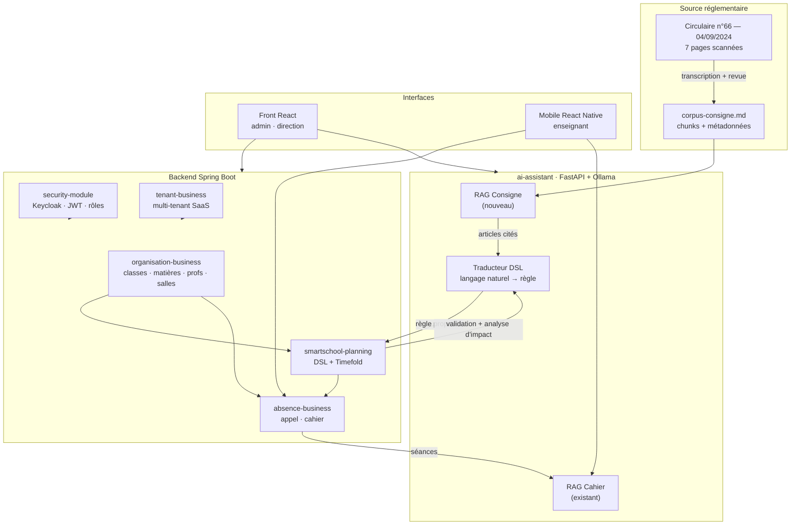

# Plan de recentrage du PFE — SmartSchool

> **Contexte.** L'encadreur académique juge le projet trop large et trop
> « classique » : beaucoup de modules CRUD, peu de profondeur scientifique. La
> réponse n'est pas d'ajouter, c'est de **retirer la largeur pour financer une
> profondeur** : un RAG ancré sur la circulaire ministérielle qui régit
> réellement la construction des emplois du temps en Tunisie.
>
> **Fenêtre.** Rédigé le **vendredi 4 septembre 2026**. Gel du code
> **dimanche 6 septembre au soir**. Soutenance **lundi 7 septembre**.
> Trois jours pleins, pas quatre.

---

## 0. État d'avancement

> **Point d'arrêt : nuit de vendredi à samedi, 1 h du matin.** Dépôt propre,
> rien en cours, `pytest` vert (**192**), `tsc` mobile vert, `main` poussé sur
> `origin`. `main` = **b226247**.
>
> **Les six étapes du plan sont faites.** Il ne reste que du hors-code :
> SonarCloud, et une répétition téléphone en main. Le gel est dimanche soir —
> il reste donc **deux jours pour deux tâches d'une heure**.

### Pour reprendre demain

Rien n'est en cours, mais **rien ne survit non plus à un redémarrage** : les
services tournaient encore au moment du point d'arrêt. Séquence complète, dans
cet ordre.

```bash
cd ~/pfe/schoolSys

# 1. Les 6 conteneurs, avec le nom d'hôte fixe pour Keycloak.
#    Sans la surcouche, le mobile obtiendra un 401 sur tous les écrans.
export LAN_HOST=$(ip -4 addr show | grep -oP '(?<=inet )192\.168\.[0-9.]+' | head -1)
docker compose -f docker-compose.yml -f docker-compose.mobile.yml up -d

# 2. L'API. Le secret se relit par l'API d'admin (commande dans mobile/README.md).
export KC_CLIENT_SECRET="<secret du client smartschool-backend>"
export KEYCLOAK_ISSUER_URI="http://$LAN_HOST:8081/realms/smartschool"
export KEYCLOAK_SERVER_URL="http://$LAN_HOST:8081"
cd backend && mvn spring-boot:run -pl smartschool-api -Dspring-boot.run.profiles=demo

# 3. L'assistant — celui du port 8001, pas le conteneur : Ollama n'écoute
#    que sur le 127.0.0.1 de l'hôte, hors de portée du conteneur.
cd ai-assistant
export KEYCLOAK_ISSUER_URL="http://$LAN_HOST:8081/realms/smartschool"
.venv/bin/uvicorn app.main:app --host 0.0.0.0 --port 8001

# 4. Le mobile. `npm start` impose le port 8082 : le 8081 est pris par Keycloak.
cd mobile && npm start
```

**`DB_PASSWORD` est dans le `.env` de la racine** (non versionné). Sans lui,
l'API s'arrête sur `password authentication failed for user "postgres"` : le
volume `app_pg_data` a été créé avec un mot de passe différent du défaut.

**Compte de démonstration** : `mehdi.ben.ali` — un enseignant qui a une fiche,
un emploi du temps publié et des séances. Son mot de passe a été fixé
vendredi soir ; en cas d'oubli, la commande de réinitialisation est dans
`mobile/README.md`.

**À vérifier en premier demain** : le résultat du pipeline GitHub Actions sur
les trois derniers *push*. Le job *Assistant IA* installe depuis
`requirements.txt`, où `pypdf` et `python-multipart` viennent d'entrer — vert
en local, non confirmé en CI.

### Le § 6 est terminé. Le mobile tourne sur téléphone.

Application Expo, six écrans, quatre onglets. L'enseignant y retrouve ses cours
du jour, fait l'appel en un tap par exception, remplit son cahier de séance,
consulte sa semaine et ses classes, et interroge l'assistant — soit sur ses
propres cahiers, soit sur un cours PDF qu'il joint.

**Le blocage annoncé au § 6.2 n'était pas celui qu'on croyait.** Ce n'est pas
CORS — une application native n'y est pas soumise — mais **l'émetteur du jeton**.
Keycloak en `start-dev` le construit depuis l'en-tête `Host` : un jeton demandé
depuis le téléphone porte `http://<ip>:8081/…` là où l'API attend
`http://localhost:8081/…`. Résultat : connexion réussie, **401 sur tous les
écrans**, sans rien qui explique pourquoi. `docker-compose.mobile.yml` fixe
`KC_HOSTNAME` ; `application.yml` externalise `issuer-uri` et `server-url`, avec
`localhost` par défaut — le web n'est pas touché.

### Le § 5 est terminé.

Le DSL se pilote désormais à la phrase. L'écran des règles maison s'ouvre sur
un champ de texte, plus sur un formulaire ; le constructeur champ par champ
subsiste sous « Mode expert », pour qui connaît le vocabulaire. Et l'impact
d'une règle candidate se lit en français avant qu'on ne la valide.

### Le § 4 est terminé. La contribution du PFE existe de bout en bout.

C'était le seul point dur du plan, et il est passé. La chaîne complète est en
place : un texte réglementaire scanné devient un corpus interrogeable, qui
ancre la traduction de règles, qui alimente un écran d'activation, et qui
répond à une question libre — chaque maillon citant sa page et son article.

### Fait avant aujourd'hui

| # | Étape | Preuve |
|---|---|---|
| — | Renommage des coordonnées Maven en `tn.schoolsys` / `schoolsys-*` | plus aucune collision `~/.m2` |
| §3.1 | Suppression des 4 modules backend | `mvn verify` vert, **562 tests** |
| §3.3 | Nettoyage du front, 10 fichiers retouchés | `npm run build` vert, `oxlint` 0 erreur |
| §7.1 | Dépôt git + push GitHub, secrets sortis du code | dépôt privé |
| §7.2 | JaCoCo + module `coverage-report` | **36,5 %** agrégés (41,9 % vus par Sonar, hors DTO) |
| §7.4 | Dockerfiles backend et front | 3 images construites en local et en CI |
| §7.5 | Pipeline GitHub Actions, 4 jobs | run #2 tout vert |

### Fait aujourd'hui — § 4 en entier, 5 commits

| Commit | Contenu | Preuve |
|---|---|---|
| `f0cc441` | **Corpus + RAG consigne.** 22 chunks transcrits à la main depuis le scan arabe (18 articles + 3 tableaux + légende), recherche hybride dense + lexical | 41 tests, boot `22 articles indexés en 296 ms` |
| `a306519` | **Ancrage de la traduction DSL.** `sources` + drapeau `concordance` | 157 tests |
| `1642f65` | **NFKD, pluriels, synonymes du domaine** | rang 1 : 6 → 9 · top-3 : 10 → 12 |
| `08bc7d5` | **Écran « Contraintes officielles »** + `GET /api/consigne/articles` | tsc + build verts |
| `4a73947` | **`POST /api/consigne/chat`** + boîte de question dans l'onglet | 18 tests, 175 au total |
| `05e6546` | **§5 — la phrase en entrée par défaut**, « Mode expert » pour le constructeur, impact chiffré en français | tsc, oxlint, build verts |

**Chiffres à réutiliser tels quels dans le rapport et à la soutenance :**

- corpus : **22 chunks**, 18 articles + 3 tableaux + 1 légende, indexés en **296 ms** ;
- recherche, apport du canal lexical, sur **deux jeux de questions distincts** —
  ne pas les mélanger dans le rapport :
  · les **13 questions figées dans `tests/test_consigne_rag.py`** : rang 1
    **6 → 9**, top-3 **10 → 12** ;
  · le **balayage de λ sur 16 questions** (les 13 plus 3 reformulations de la
    question « 6 h par jour ») : rang 1 **6 → 11**, top-3 **10 → 14** ;
- plancher : pertinentes ≥ **0,637**, hors-sujet ≤ **0,574**, écart **0,063** ;
- chat : **1 à 7 s** avec articles, **120 ms** sans — le modèle n'est alors pas appelé ;
- tests service Python : **175 verts**, 1 `xfail` documenté.

### Les quatre décisions à défendre devant le jury

Ce sont les vraies contributions. Chacune est un problème **mesuré**, pas une
intuition, et chacune est consignée dans le code à l'endroit qu'elle concerne.

1. **N'indexer que le texte normatif, pas notre analyse.** En indexant les deux,
   les 22 chunks se ressemblaient tous : « donne-moi une recette de couscous »
   marquait **0,639**, au-dessus de la pire question légitime (**0,625**). Les
   deux populations se chevauchaient, aucun seuil ne pouvait plus les séparer.
   Article seul : hors-sujet 0,574, pire cas légitime 0,637.

2. **Recherche hybride, plancher sur le dense seul.** 22 articles du même texte
   se ressemblent trop pour le dense. Le lexical classe, il n'autorise pas :
   filtrer sur le score combiné laisserait passer une question hors sujet
   partageant par hasard un terme rare. λ = 0,30 est un **choix argumenté**, pas
   un optimum — le balayage monte encore, mais laisser le lexical dominer
   reviendrait à faire de la correspondance de mots-clés.

3. **L'ancrage provoque une régression, et il a fallu la traiter.** Montrer un
   article à un 7B le pousse à traduire l'article. Mesuré sur 5 phrases × 3
   passages : « de préférence des maths le matin » PERDAIT sa condition
   `period = MORNING`, le § III.2.a nuançant en 3/4 – 1/4. Le garde-fou
   n'interdisait que d'AJOUTER une condition ; le cas rencontré est l'inverse.
   Corrigé, puis **vérifié sur des phrases tenues à l'écart** : 2 améliorées,
   2 inchangées, 0 dégradée — l'ancrage fait désormais mieux que son absence.

4. **Un total se lit, il ne s'estime pas.** Le modèle répondait « 4 heures » pour
   `2+1+1+1` en comptant les séances. **Quatre reformulations du prompt n'y ont
   rien changé**, dont un « NE CALCULE JAMAIS » en capitales. Correctif
   structurel : les totaux sont calculés par script et inscrits dans le corpus.
   C'est le même principe que `retrieval.py` applique déjà à la couverture du
   cahier de séance.

> **La phrase de la soutenance.** *« Le modèle ne décide de rien. Il traduit ; le
> validateur Java refuse ou accepte ; l'analyse d'impact chiffre ; la citation
> rend le tout vérifiable ; l'humain confirme. Une règle fausse est refusée, pas
> appliquée. »*

### Ce que le mobile a apporté, chiffré

- chaîne complète vérifiée en HTTP depuis l'IP du réseau local, **onze étapes** :
  jeton → fiche enseignant → emploi du temps publié → ouverture de l'appel
  (**31 lignes, toutes `PRESENT`**) → changements de statut → refus **400** d'une
  exclusion sans raison → cahier → assistant ;
- **préparation de cours** : dépôt d'un PDF de 2 pages, puis explication d'un
  passage en **27 s**, QCM de 4 questions avec corrigé en **28 s** ;
- **192 tests Python verts** (175 auparavant), 1 `xfail` documenté ;
- vitesse mesurée du modèle : **26,9 jetons/s** sur `qwen2.5:7b`, 56,1 sur le 3B.
  C'est ce chiffre qui a permis de dimensionner la génération sans essais.

### Trois pièges rencontrés, tous consignés dans le code

Ils valent d'être racontés : chacun se présentait sous un symptôme qui désignait
le mauvais coupable.

1. **L'émetteur du jeton** (ci-dessus) : ressemble à une panne d'authentification,
   se corrige dans la configuration de Keycloak.
2. **`Unsupported FormDataPart implementation`** : depuis le SDK 52, Expo
   remplace le `fetch` global et **n'accepte plus** la forme
   `{ uri, name, type }`, pourtant la forme documentée partout pour React
   Native. L'échec a lieu **avant tout envoi réseau** — la trace serveur reste
   vide, et le symptôme ressemble à un serveur injoignable.
3. **`missing read permission`** : `expo-document-picker` écrit sa copie dans un
   cache partagé par toutes les expériences d'Expo Go, qu'`expo-file-system`
   n'a pas le droit de lire. La sortie n'est pas d'élargir la permission mais de
   supprimer la frontière — c'est désormais `expo-file-system` qui ouvre le
   sélecteur.

### À reprendre, dans cet ordre

1. ~~**§7.3 — SonarCloud**~~ — fait : dépôt renommé `schoolSys` et passé en
   public, projet importé, `SONAR_TOKEN` créé, clé corrigée dans le pom.
   Reste à **pousser `main`** pour déclencher la première analyse.
2. **README** : il annonce 3 conteneurs, `docker compose` en lance **6**.
3. **Répétition de la démonstration**, téléphone en main, sur le réseau de la
   salle si possible : c'est là que l'adresse du serveur change, et c'est
   précisément pourquoi elle se saisit dans l'application.

### Le § 3.4 n'est plus bloqué

`KC_CLIENT_SECRET` se lit par l'API d'administration de Keycloak, avec le
`admin`/`admin` du `docker-compose` — la commande est dans `mobile/README.md`.
L'API a démarré avec, profil `demo` :

- [x] L'application démarre **sans erreur Liquibase** (`liquibase.enabled: true`,
      « Database is up to date »), **zéro `ERROR`** au démarrage
- [x] Parcours d'appel complet, vérifié route par route depuis l'IP LAN
- [ ] L'onglet « Officielles » et « Activer la règle » — à refaire depuis le web

### Points ouverts

- `absence-business` est à **14,8 %** de couverture. C'est le module qui part en
  mobile — si une heure se libère dimanche, c'est là qu'elle rapporte le plus.
- Le Quality Gate SonarCloud sera **rouge** au premier passage. Attendu,
  argumenté au §7.3 : le retourner en argument, pas le cacher.
- **Limites du RAG, à assumer plutôt qu'à masquer** (toutes trois consignées
  dans le code, deux par un test) :
  - collision § I.3 / § III.1 sur « coupure matin/après-midi » — `xfail`
    documenté, les deux articles parlent du même découpage de la journée ;
  - le § II.2 (6 h/jour côté enseignant) entre dans le top-3 mais pas toujours
    en tête : le § I.2 porte la même règle côté élève, mêmes chiffres, un mot
    d'écart. `concordance` empêche la citation fausse ;
  - le chat ne nomme pas toujours les trois types d'établissement, et omet
    parfois la séance de quinzaine. **Aucune valeur fausse** — des
    incomplétudes, pas des erreurs.
- **Le mobile n'a pas non plus d'infrastructure de test.** Le même arbitrage que
  pour le front, et la même réponse : à deux jours du gel, une suite de tests
  d'interface coûterait plus qu'elle ne protège. Ce qui est vérifié l'est
  autrement — `tsc` en mode strict, construction du bundle Android à chaque
  changement, et la chaîne HTTP éprouvée route par route.
- Le front n'a **aucune infrastructure de test**. Le parseur de tableaux
  markdown a été vérifié en compilant le vrai composant avec rolldown ; en
  ajouter une à deux jours du gel serait le mauvais arbitrage.

---

## 1. La décision de périmètre

### 1.1 Ce qu'on garde, et pourquoi c'est cohérent

Le projet réduit raconte **une seule histoire**, de bout en bout :

> Un document du ministère fixe des règles et des volumes horaires.
> La plateforme les rend **lisibles** (RAG), **exécutables** (DSL de
> contraintes), **appliquées** (solveur d'emploi du temps), puis **vérifiées
> sur le terrain** (appel et cahier de séance, avec recherche sémantique).

| Module | Rôle dans l'histoire | Statut |
|---|---|---|
| `security-module` | Socle : Keycloak, JWT, rôles, `TenantContext` | **Gardé, inchangé** |
| `tenant-business` | Socle SaaS multi-tenant : établissements, abonnements | **Gardé, inchangé** |
| `common-module` | Socle : `BaseEntity`, filtre Hibernate tenant, exceptions | **Gardé, allégé** (audit retiré) |
| `organisation-business` | Source de vérité académique : classes, matières, enseignants, salles, créneaux, programmes | **Gardé, dégraissé** (§3.2) |
| `smartschool-planning` | **Cœur scientifique** : DSL de contraintes + solveur Timefold | **Gardé, renforcé** (§4, §5) |
| `absence-business` | Vérification terrain : appel, justificatifs, cahier de séance | **Gardé** + mobile (§6) |
| `ai-assistant` (Python) | RAG cahier (existant) + **RAG consigne (nouveau)** + traduction DSL | **Gardé, étendu** (§4) |

### 1.2 Ce qu'on supprime, et l'argument à tenir devant le jury

| Module supprimé | Fichiers Java | Argument |
|---|---|---|
| `budget-business` | 41 | CRUD financier. Aucun lien avec l'emploi du temps ni avec la consigne. C'est un autre projet. |
| `pointage-business` | 34 | Pointage du **personnel**. Redondant avec l'absence **élève**, qui est celle que la consigne encadre. |
| `audit-business` | 17 | Journal technique. Ne se démontre pas, ne se soutient pas. |
| `notification-business` | 11 | Notifications persistées. La progression du solveur passe déjà par WebSocket (`SolverProgressWebSocketAdapter`), qui **ne dépend pas** de ce module. |

**Total retiré : 113 classes Java (99 dans les modules + 14 dans `smartschool-api`)
+ 2 schémas Liquibase inclus + 10 composants React.**

> **Formulation pour la soutenance** — ne jamais dire « je n'ai pas eu le
> temps ». Dire : *« Le périmètre initial couvrait la gestion administrative
> complète d'un établissement. Je l'ai volontairement resserré sur la chaîne
> réglementation → planification → exécution, parce que c'est la seule où
> le travail est autre chose que du CRUD. »*

### 1.3 Vérification faite : la suppression est mécanique

Aucun des quatre modules n'est importé par un module conservé. Tout le
couplage est localisé dans `smartschool-api` :

```
audit        → api/audit/AuditController.java
budget       → api/budget/*.java                       (5 fichiers)
pointage     → api/pointage/*.java + adapter/          (5 fichiers)
notification → api/notification/*.java
             + api/planning/adapter/SolverJobNotificationAdapter.java   ← seul point sensible
```

`SolverJobNotificationAdapter` publie une notification persistée à la fin d'un
job solveur. Il se supprime sans conséquence : la progression **temps réel**
est publiée par `SolverProgressWebSocketAdapter`, qui n'implémente que le port
`SolverProgressPublisher` du module planning.

---

## 2. Architecture cible



**Le point à défendre** : la flèche `RAGC → DSLT` est la contribution. Une
règle proposée par l'IA n'est pas inventée — elle est **dérivée d'un article
identifiable de la circulaire**, et affichée avec sa citation.

---

## 3. Suppressions — mode opératoire

### 3.1 Modules entiers (≈ 1 h 30)

Ordre impératif : backend d'abord (le compilateur signale les oublis), front
ensuite.

```bash
cd ~/pfe/schoolSys/backend

# 1. Les modules
rm -rf budget-business pointage-business audit-business notification-business

# 2. Le pom parent : retirer les 4 <module> correspondants
#    (garder security, common, tenant, organisation, smartschool-api,
#     smartschool-planning, absence)

# 3. smartschool-api/pom.xml : retirer les 4 <dependency>

# 4. Les contrôleurs et adaptateurs
rm -rf smartschool-api/src/main/java/tn/wtm/school/api/{audit,budget,pointage,notification}
rm -f  smartschool-api/src/main/java/tn/wtm/school/api/planning/adapter/SolverJobNotificationAdapter.java

# 5. Liquibase — smartschool-api/src/main/resources/db.changelog/db.changelog-master.yaml
#    supprimer les blocs « audit schema » et « notification schema »
#    (budget et pointage ont leur propre master, non inclus : rien à faire)

# 6. application.yml : supprimer le bloc app.audit (enabled / max-value-length /
#    excluded-entities)

mvn -o clean install -DskipTests    # doit passer
```

**Base de données.** Les tables `audit_log`, `notification`, `budget_*`,
`pointage_*` restent en base. Ne pas les supprimer à la main : recréer la base
de démo est plus sûr et plus rapide.

```bash
docker compose down -v && docker compose up -d      # repart d'une base propre
```

### 3.2 Dégraissage d'`organisation-business` (≈ 45 min)

`organisation-business` est le plus gros module (148 classes) mais **c'est la
source d'alimentation de `planning` et d'`absence`** — la marge est faible.
Vérifié : `planning` lit `Pattern`, `PatternDetail`, `Room`, `SchoolYear`,
`SubjectSessionType`, `Teacher`, `TeachingAssignment`, `TimeSlot`,
`DayPeriod`, `WeekParity` ; `absence` lit les élèves et le contexte scolaire.
Rien de tout cela ne peut partir.

Ce qui peut partir sans casser la chaîne :

| À retirer | Fichiers | Pourquoi |
|---|---|---|
| Import Excel / CSV | `util/ExcelImportHelper.java`, `EleveImportResult`, `TeacherImportResult`, `RoomImportResult` + les endpoints d'import + les boutons d'import du front | Fonction d'intégration, pas de fond. Le `DemoDataRunner` fournit déjà un jeu de données complet. Retire aussi 2 dépendances lourdes du pom (`poi-ooxml`, `commons-csv`). |
| Création en masse de classes | `BulkCreateClassGroupRequest`, `BulkCreateClassGroupResult` | Confort d'UI, pas une contribution. |

> **Décision assumée** : `NationalPattern` (programme officiel) **et** `Pattern`
> (programme adapté par l'établissement) sont **tous deux conservés** malgré la
> duplication apparente. C'est précisément le lien entre le document
> ministériel et le solveur : le tableau horaire de la page 5 de la circulaire
> **est** ce que `NationalPatternSeeder` injecte. Le supprimer couperait
> l'histoire en deux.

**Le vrai allègement d'`organisation` est côté interface**, pas côté code :
regrouper les 11 écrans en 4 onglets (`Structure` · `Ressources` ·
`Programmes` · `Comptes`) dans `AcademiqueDashboard.tsx`. Zéro risque
backend, effet immédiat sur la démonstration.

### 3.3 Front — ✅ FAIT (plus lourd que prévu)

**L'estimation de 45 min était fausse.** Les suppressions de fichiers ne
représentaient que la moitié du travail : **cinq tableaux de bord embarquaient
des widgets budget/pointage** et ont dû être retouchés à la main.

Fichiers supprimés :

```bash
rm -rf src/features/budget src/features/pointage
rm -f  src/features/rapports/JournalAudit.tsx
rm -f  src/features/enseignant/Notifications.tsx
rm -f  src/api/{budget,pointage,audit}.api.ts
```

Fichiers **retouchés** (le vrai travail) :

| Fichier | Ce qui a été retiré | Remplacement |
|---|---|---|
| `router/index.tsx` | 9 imports + 10 routes | — |
| `layout/Sidebar.tsx` | groupes « Pointage » et « Budget » (admin + surveillant), lien Audit, lien Notifications, 4 clés `CATEGORY_MAP`, 4 icônes | — |
| `layout/Topbar.tsx` | alertes budgétaires de la cloche | seules restent les alertes planning |
| `dashboard/DashboardEcole.tsx` | carte « Budget résumé » | grille passée de 3 à 2 colonnes |
| `dashboard/QuickActions.tsx` | 3 actions rapides | — |
| `statistiques/DashboardStatistiques.tsx` | 2 cartes domaine + 1 KPI + 2 requêtes | KPI « Plannings publiés » |
| `rapports/RapportsAnalyses.tsx` | **onglet « Finances » entier**, graphe présence personnel, 1 KPI | KPI « Enseignants en poste » |
| `surveillance/DashboardSurveillant.tsx` | 2 requêtes pointage, 1 KPI, encart justificatifs personnel | KPI « Appels encore ouverts » |
| `parametres/Parametres.tsx` | préférence « Alertes budgétaires » | — |
| `public/locales/{fr,ar,en}/translation.json` | 12 clés `nav.*` mortes × 3 langues | — |

> **Leçon à retenir pour la suite du plan** : un module « isolé » côté backend
> ne l'est pas côté front. Les tableaux de bord agrègent tout. Prévoir ce
> surcoût pour toute suppression ultérieure.

`tsc -b` a servi de filet exactement comme prévu : il a signalé les 4 derniers
imports morts (`Line`, `LineChart`, `DollarSign`, `today`).

### 3.4 Critère de fin d'étape

- [x] `mvn -o clean install` **vert** (7 modules)
- [x] `mvn -o test` **vert — 562 tests, 0 échec, 0 erreur, 9 ignorés**
      (tenant 19 · organisation 300 · planning 236 · absence 7)
- [x] `npm run build` **vert** · `oxlint` : 7 warnings préexistantes, 0 erreur
- [ ] `docker compose up -d` puis `mvn spring-boot:run -pl smartschool-api -Dspring-boot.run.profiles=demo` démarre sans erreur Liquibase
- [ ] Connexion, génération d'un emploi du temps, saisie d'un appel : OK

> **Base de données — à savoir avant de relancer.** Les tables `audit_log`,
> `notification`, `budget_*` et `pointage_*` existent toujours dans la base de
> développement. Liquibase ne s'en plaint pas (il ne valide que les changesets
> encore présents dans le master), donc l'application démarre. Pour repartir
> propre : `docker compose down -v && docker compose up -d`.

> **Sauvegarde.** Tout ce qui a été supprimé est archivé dans
> `backup-modules-supprimes.tgz` (244 fichiers) — le projet n'étant pas encore
> sous git au moment de l'opération. À reprendre depuis git dès le § 7.1 fait.

---

## 4. Le RAG « Consigne ministérielle » — la contribution

### 4.1 Le problème réel

`docs/consigne.pdf` — circulaire **n°66 du 4 septembre 2024**, ministère de
l'Éducation, direction de la pédagogie du cycle préparatoire et secondaire —
contient exactement ce dont un directeur a besoin pour bâtir ses emplois du
temps, et exactement ce qu'un logiciel ne sait pas lire :

**Pages 2-3 — recommandations (15 règles).** Extraits :

| # | Règle | Traduction en contrainte |
|---|---|---|
| I.2 | Emploi du temps élève : **6 h/jour maximum, 2 h minimum** par demi-journée (sauf éducation physique) | `CLASS_DAY` + `TOTAL_HOURS > 6` → `PENALIZE/HARD` |
| I.3 | **2 h de coupure** entre les séances du matin et de l'après-midi | `CLASS_DAY`, contrainte de pause |
| I.4 | Interdiction de changer de salle pour une même classe dans une demi-journée, sauf salles spécialisées | `LESSON`, stabilité de salle |
| I.5 | **Heures creuses interdites** dans l'emploi du temps des élèves | `CLASS_DAY`, compacité |
| II.2 | Enseignant : **6 h/jour max, 2 h min** par demi-journée, réparties équitablement | `TEACHER_DAY` + `TOTAL_HOURS > 6` |
| II.3 | **5 h consécutives** autorisées le vendredi et le samedi | `TEACHER_DAY`, exception jour |
| II.4 | **Alternance matin/après-midi** sur les 4 premiers jours de la semaine | `TEACHER_WEEK` |
| II.5 | Au moins **deux niveaux différents** par enseignant | `TEACHER_WEEK` |
| III.2 | **3/4 du volume** des matières fondamentales (arabe, français, maths) le **matin**, 1/4 l'après-midi | `LESSON` + `REWARD` matin |
| III.2 | Éducation physique : 3 séances espacées **ou** 2 séances (2 h + 1 h), **24 h de séparation** minimum | `LESSON`, espacement |
| III.2 | Une matière à 2 h/semaine ne se programme pas sur **deux jours consécutifs** | `LESSON`, espacement |
| III.4 | Travaux pratiques **en salle spécialisée uniquement**, sauf nécessité absolue | `LESSON`, type de salle |

**Pages 5-7 — trois tableaux de volumes horaires** (collèges, collèges
techniques, collèges pilotes), par matière et par niveau (7ᵉ, 8ᵉ, 9ᵉ), avec une
notation propre au ministère : `2+1+1+1` = découpage des séances,
`(2)` = séance en système de groupes, `①` = séance quinzaine pour la classe
entière.

Aujourd'hui, ces règles vivent dans la tête du directeur. Elles ne sont **ni
consultables, ni traçables, ni reliées** aux contraintes réellement activées
dans le solveur.

### 4.2 Obstacle technique — à traiter en premier

**Le PDF est un scan.** Sept images JPEG 1654×2338, **aucune couche texte**
(`pdftotext` renvoie zéro caractère ; `pdffonts` ne liste aucune police), et le
texte est en **arabe**. Trois options :

| Option | Coût | Risque | Verdict |
|---|---|---|---|
| OCR à l'exécution (`tesseract-ocr-ara`) | installation + 30 min | Qualité OCR arabe sur scan penché : **imprévisible**, casse les tableaux | ❌ pas à 3 jours de la soutenance |
| OCR une fois, puis **relecture manuelle** | 1 h | Faible | ✅ si le temps le permet |
| **Transcription manuelle structurée** dans un `.md` versionné | 1 h 30 | Nul | ✅ **retenu** |

**Décision : corpus transcrit à la main, versionné, cité page par page.** Ce
n'est pas un contournement — c'est la pratique normale d'un corpus RAG de
référence : *un corpus réglementaire se vérifie, il ne s'OCRise pas à
l'aveugle*. À écrire noir sur blanc dans le rapport, avec la limite assumée :
« l'extraction automatique de documents scannés arabes est hors périmètre ;
le corpus est transcrit et relu, la traçabilité page/article est garantie ».

### 4.3 Le corpus

Fichier : **`ai-assistant/data/corpus-consigne-2024.md`**

Un chunk = **un article**, jamais un paragraphe coupé arbitrairement. Le
document en compte ~15 + 3 tableaux : le corpus fait ~20 chunks. À cette
taille, aucune base vectorielle n'est nécessaire — un produit scalaire sur 20
vecteurs coûte moins qu'un aller-retour réseau.

```markdown
---
id: I.2
page: 2
section: "Recommandations concernant l'élève / la classe"
portee: CLASS_DAY
severite_suggeree: HARD
---
Les emplois du temps des élèves sont établis sur la base de six heures par
jour au maximum et de deux heures au minimum par demi-journée, matin ou
après-midi. Remarque : cette règle ne s'applique pas à l'éducation physique.

**Source** — Circulaire n°66 du 04/09/2024, p. 2, § I.2
**Texte original** — تعدّ جداول أوقات التّلاميذ على أساس ست ساعات في اليوم كحدّ أقصى وساعتين كحدّ أدنى صباحا أو مساء
```

Chaque chunk porte **le français (indexé), l'arabe (cité), la page et
l'article**. Le champ `portee` pré-mappe l'article sur un `DslScope` existant
(`LESSON`, `CLASS_DAY`, `TEACHER_DAY`, `TEACHER_WEEK`, `ROOM_DAY`…) : c'est ce
qui permettra de proposer une règle en un clic.

### 4.4 Le service Python

Nouveau fichier : **`ai-assistant/app/services/consigne_retrieval.py`**

Il se calque sur `retrieval.py` (RAG cahier) mais est **radicalement plus
simple**, et il faut le dire au jury car c'est un choix de conception :

| | RAG Cahier (existant) | RAG Consigne (nouveau) |
|---|---|---|
| Corpus | Dynamique, par utilisateur | **Statique, public** |
| Périmètre | Cloisonné par jeton (un prof ≠ un directeur) | **Aucun cloisonnement** : le texte est réglementaire |
| Index | Construit à la 1ʳᵉ question, TTL 10 min, éviction LRU | **Construit une fois au démarrage, jamais invalidé** |
| Taille | jusqu'à 500 séances | ~20 chunks |
| Citation | date — classe — matière | **page — article** |

```python
@dataclass(frozen=True)
class ArticleConsigne:
    id: str            # "I.2"
    page: int
    section: str
    texte: str         # français, ce qui est vectorisé
    texte_ar: str      # arabe, cité tel quel
    portee: str | None # DslScope pré-mappé
    severite: str | None

    @property
    def citation(self) -> str:
        return f"Circulaire n°66/2024, p. {self.page}, § {self.id}"
```

`ConsigneIndex` réutilise sans modification `_normalise()` et la logique
`plancher` + `marge` de `retrieval.py` — les seuils (`RAG_SCORE_FLOOR=0.63`,
`RAG_SCORE_MARGIN=0.03`) sont déjà mesurés sur `nomic-embed-text`. **Ne pas
les redécouvrir, les réutiliser et le justifier.**

Nouveaux réglages dans `config.py` / `.env` :

```
CONSIGNE_CORPUS_PATH=data/corpus-consigne-2024.md
CONSIGNE_TOP_K=3
CONSIGNE_SCORE_FLOOR=0.60
```

### 4.5 Les trois usages — par ordre de valeur

**① Ancrage de la traduction DSL** *(la contribution ; à faire en premier)*

`dsl_translator.py` construit aujourd'hui son prompt à partir du seul
catalogue de champs du backend. On y ajoute les articles pertinents :

```
phrase utilisateur
  → RECHERCHE dans le corpus consigne (top-3)          ← NOUVEAU
  → prompt = catalogue backend + articles retrouvés    ← NOUVEAU
  → génération JSON contrainte (Ollama, format=json, T=0)
  → validation + analyse d'impact PAR LE BACKEND
  → [si refus] une tentative de correction
  → proposition + résumé + conflits + SOURCES CITÉES   ← NOUVEAU
  → *** aucune écriture *** — confirmation séparée
```

`ConstraintProposalResponse` gagne un champ `sources: list[{id, page,
citation, extrait}]`. L'écran de confirmation affiche : *« Cette règle
correspond à l'article II.2 de la circulaire n°66/2024 (p. 2) »*.

> **C'est la phrase qui fait la soutenance** : le modèle ne décide de rien. Il
> traduit, le validateur Java refuse ou accepte, l'analyse d'impact chiffre, la
> citation rend le tout vérifiable, et l'humain confirme. Une règle fausse est
> **refusée**, pas appliquée.

**② Écran « Contraintes officielles »** *(le gain « admin non technique »)*

Nouvel onglet dans `ConfigurationContraintes.tsx`. Les ~15 articles de la
circulaire s'affichent en cartes lisibles :

```
┌────────────────────────────────────────────────────────────┐
│ § II.2  ·  Circulaire n°66/2024, p. 2         [Recommandé] │
│                                                            │
│ Un enseignant ne dépasse pas 6 heures de cours par jour,   │
│ avec un minimum de 2 heures par demi-journée.              │
│                                                            │
│ Portée : Enseignant / Jour    Sévérité : Impérative        │
│                                                            │
│              [ Voir le texte arabe ]  [ Activer la règle ] │
└────────────────────────────────────────────────────────────┘
```

« Activer la règle » ouvre `AssistantRuleModal` **pré-rempli** avec le DSL
dérivé de l'article, l'analyse d'impact déjà calculée. L'admin lit du
français, jamais du JSON.

**③ Question libre sur la circulaire** *(le moins cher, à faire en dernier)*

Route `POST /api/consigne/chat` — *« Combien d'heures de maths en 8ᵉ ? »*,
*« Puis-je mettre 5 h d'affilée à un prof le samedi ? »* — réponse en français
avec l'extrait et la page. Réutilise `ToolLoop`, ~40 lignes.

### 4.6 Découpage du travail

| Tâche | Durée | Livrable vérifiable |
|---|---|---|
| Transcription du corpus (15 articles + 3 tableaux) | 1 h 30 | `corpus-consigne-2024.md`, chunks avec `id`/`page` |
| `consigne_retrieval.py` + chargement au démarrage | 1 h 30 | log de boot : `Corpus consigne : 20 articles indexés` |
| Test : 8 questions → article attendu | 30 min | `tests/test_consigne_rag.py` vert |
| Injection dans `dsl_translator` + champ `sources` | 1 h 30 | proposition citant § II.2 |
| `GET /api/consigne/articles` + écran React | 2 h | onglet « Contraintes officielles » |
| `POST /api/consigne/chat` | 45 min | réponse citée |

---

## 5. DSL — le rendre utilisable par un non-technicien — ✅ FAIT

Le socle était déjà là (`DslRuleBuilder`, `AssistantRuleModal`,
`RuleAnalysisPanel`, `SuggestionsPanel`, `ConstraintDslValidator`,
`PlanningConflictService`). Ce qui manquait n'était pas du moteur, c'était de
**l'ergonomie et de la formulation**. Quatre retouches, toutes livrées :

1. **Inverser l'entrée par défaut.** ✅ `05e6546`. L'onglet
   « Personnalisées » s'ouvre sur **un champ de phrase** — *« Décrivez votre
   règle : "pas de sport le vendredi après-midi" »* — avec ses exemples
   cliquables ; le constructeur champ par champ est passé sous « Mode expert ».
   La demande transite par `initialRequest`, la même porte que l'activation
   d'un article de la circulaire : la traduction se lance d'elle-même, et le
   parcours en deux temps est inchangé — proposer n'écrit rien.

2. **Résumé en français, jamais de JSON visible.** ✅ `08bc7d5`. Le résumé
   affiché est celui du compilateur Java — ce que le moteur appliquera, pas une
   reformulation du modèle. Le seul `JSON.stringify` de tout le dossier
   `constraints/` est replié derrière un `<details>` « Détail informatique
   (réservé au support) ».

3. **Impact chiffré en langage courant.** ✅ `05e6546`. La pastille
   « 42 sur 310 » est devenue *« Cette règle concerne 42 séances sur 310
   (13 %) »*, les conflits gardant leur bloc propre. **Le cas zéro est traité à
   part**, en avertissement : une règle valide qui ne touche aucune séance est
   presque toujours un critère trop étroit — une matière mal orthographiée, un
   niveau absent de l'année — et « 0 sur 310 » se lit comme un chiffre bas, pas
   comme un problème. C'est le même principe que le reste du parcours : la
   valeur brute est exacte, seule sa formulation décide de ce qui sera compris.

4. **Catalogue officiel** ✅ `08bc7d5` = l'écran § 4.5 ②. C'est le vrai déblocage :
   l'admin n'écrit pas de règle, il **active** celles que le ministère a déjà
   écrites, et n'utilise la saisie libre que pour ses règles maison.

---

## 6. Absence — application mobile React Native — ✅ FAIT

> **Livré, et plus large que le périmètre prévu** : six écrans au lieu de trois,
> dont le planning de la semaine, les classes, et un assistant qui travaille sur
> un cours PDF déposé. Les routes citées ci-dessous étaient approximatives ; les
> vraies sont dans `mobile/README.md`. Le plan B du §6.3 n'a pas eu à servir.

### 6.1 Périmètre : trois écrans, pas un de plus

Le backend est **déjà complet** (`AppelController`, `CahierController`,
`/api/cahier/assistant/chat`). Le mobile n'est qu'un client.

| Écran | Contenu | API existante |
|---|---|---|
| **Mes séances du jour** | Liste des séances de l'enseignant connecté | `GET /api/appels/…` |
| **Faire l'appel** | Élèves de la classe, présent/absent en un tap, envoi | `POST /api/appels/{id}/lignes` |
| **Cahier + Assistant** | Saisie du cahier de séance, puis onglet chat *« Qu'ai-je fait avec la 8ᵉ A ? »* | `POST /api/cahier`, `POST /api/cahier/assistant/chat` |

### 6.2 Choix techniques dictés par le délai

- **Expo** (`npx create-expo-app`), pas React Native CLI : pas de toolchain
  Android à configurer, démonstration sur **Expo Go** via le Wi-Fi.
- **Authentification** : réutiliser le flux mot de passe existant plutôt que
  d'implanter OIDC/PKCE mobile. *PKCE mobile est un piège à 4 h minimum ; ce
  n'est pas le sujet du PFE.*
- **Réseau** : le backend écoute sur `localhost` — sur mobile il faut l'IP LAN
  de la machine (`http://192.168.x.x:8080`) **et** ajouter cette origine à
  `CORS_ORIGINS`. À tester **tôt**, c'est le blocage classique.
- **Pas de mode hors-ligne.** Tentant, hors budget.

### 6.3 Plan B, à décider samedi soir

Si le mobile n'est pas fonctionnel **dimanche 14 h**, on l'abandonne et on
livre les mêmes écrans en **web responsive** (les composants React existent
déjà : `SessionsAppel.tsx`, `MonCahier.tsx`, `CahierAssistantPanel.tsx`). Une
vue mobile du navigateur suffit à démontrer l'usage terrain. Il vaut mieux une
démonstration web qui marche qu'une application native qui plante devant le
jury — et le rapport présente alors le mobile comme perspective, ce qui est
une conclusion honorable.

---

## 7. DevOps — CI/CD, JaCoCo, SonarCloud, Docker

### 7.1 Dépôt git — ✅ FAIT

**Dépôt : https://github.com/aymenkh9090/schoolSys — public, branche `main`,
650 fichiers.**

> Le dépôt a été **renommé** (`smartschool` → `schoolSys`) et **passé en
> public** au moment de brancher SonarCloud : le plan gratuit n'analyse que les
> dépôts publics. La bascule n'a été faite qu'après un scan de **tout
> l'historique** (tokens `ghp_`/`glpat-`, clés AWS, clés privées, mots de passe
> littéraux dans les `*.yml`) — **aucune occurrence réelle**. Ne subsistent que
> les quatre identifiants de développement local assumés plus bas
> (`keycloak_secret` ×2, `admin` Keycloak, `admin` Grafana) et le
> `DB_PASSWORD=smartschool` du `.env.example`.
>
> Le renommage a deux conséquences à ne pas manquer : l'URL du remote git
> (GitHub redirige, mais `git remote set-url` évite le piège) et surtout la
> **clé de projet SonarCloud**, dérivée du nom GitHub du dépôt — voir §7.3.

Ce qui a été fait avant le premier push :

| Action | Détail |
|---|---|
| Secrets sortis du code | Le mot de passe PostgreSQL personnel était en clair dans `application.yml`, `application-dev.yml`, `application-demo.yml` et `docker-compose.yml`. Remplacé partout par `${DB_PASSWORD:smartschool}` (`${DB_PASSWORD:-smartschool}` côté compose). |
| `.gitignore` | `target/`, `node_modules/`, `dist/`, `.venv/`, `__pycache__/`, `.pytest_cache/`, `.idea/`, `*.log`, et **`.env` / `.env.*` sauf `.env.example`**. |
| `.env.example` | Documente `DB_PASSWORD`. Lu automatiquement par docker compose. |
| Vérification avant commit | `git diff --cached` scanné : **0 occurrence** de mot de passe, de token `glpat-`/`ghp_` ou de clé privée. Seuls les `.env.example` sont versionnés. |

> ⚠️ **Conséquence sur ton environnement local.** Le mot de passe de la base
> applicative vaut désormais `smartschool` par défaut. Deux options :
>
> ```bash
> # Option A (recommandée) — repartir d'une base propre, ce que le § 3.4
> # demande de toute façon après la suppression des 4 modules :
> docker compose down -v && docker compose up -d
>
> # Option B — garder la base existante avec l'ancien mot de passe :
> export DB_PASSWORD='<ton ancien mot de passe>'
> ```
>
> L'ancien mot de passe subsiste dans `backend/*/target/classes/*.yml`
> (sortie de compilation, ignorée par git) — il disparaît au prochain
> `mvn clean`. Il reste aussi celui de ta base PostgreSQL actuelle tant que
> tu ne l'as pas recréée.

> **Restent en clair, volontairement** : `keycloak_secret`, `admin/admin`
> (Keycloak, Grafana) dans `docker-compose.yml`. Ce sont des identifiants de
> développement local, sans valeur hors de la machine — pratique courante pour
> un compose de dev. À mentionner si le jury pose la question, et à remplacer
> par des variables d'environnement dans un vrai déploiement.

### 7.2 JaCoCo — ✅ FAIT

Le plugin est déclaré **une fois dans le pom parent**, dans `<build><plugins>` :
tous les modules en héritent, aucun n'a besoin de le redéclarer.

- `prepare-agent` (phase `initialize`) pose l'agent **avant** surefire. Sans
  lui les tests tournent mais rien n'est mesuré — c'est l'erreur la plus
  fréquente.
- `report` (phase `verify`) écrit le XML que Sonar viendra lire.

**Un module `coverage-report` a été ajouté** pour l'agrégation. Il ne contient
aucun code : ses `<dependencies>` ne servent qu'à indiquer à `report-aggregate`
quels modules agréger. Sans lui, JaCoCo produit un rapport par module et il
n'existe aucune vue d'ensemble — chaque module ignore les lignes que les tests
d'un autre ont pourtant exécutées (le code de `common-module` traversé par les
tests de `planning`, typiquement).

**Résultat mesuré — `mvn verify`, 737 tests, 0 échec** (mesure refaite après
le branchement de SonarCloud ; la précédente datait de 562 tests et donnait
29,7 %) :

| Métrique | Couverture | Détail |
|---|---|---|
| Lignes | **36,5 %** | 3 332 / 9 117 |
| Branches | **33,8 %** | 1 299 / 3 842 |
| Instructions | **38,0 %** | 16 293 / 42 909 |
| Méthodes | **44,1 %** | 802 / 1 819 |
| Classes | **42,5 %** | 97 / 228 |

Par module (lignes) :

| Module | Couverture | Lecture |
|---|---|---|
| `tenant-business` | **67,4 %** | le socle SaaS est bien testé |
| `smartschool-planning` | **59,2 %** | **le cœur scientifique** — DSL et solveur |
| `organisation-business` | 29,0 % | beaucoup de CRUD, peu de logique |
| `absence-business` | 14,8 % | **le point faible assumé** |
| `smartschool-api` | 11,3 % | couche d'exposition, testée de bout en bout ailleurs |

> **À dire au jury, pas à cacher.** 36,5 % global n'est pas un bon chiffre dans
> l'absolu, mais la répartition est la bonne : **c'est le module qui porte la
> contribution (`planning`, 59 %) qui est le mieux couvert**, pas les écrans
> CRUD. Un projet à 80 % de couverture obtenu sur des getters vaudrait moins.
> Si le temps le permet dimanche, la cible utile est `absence-business` —
> 14,8 % sur un module qui part en mobile, c'est le vrai trou.

### 7.3 SonarCloud — projet importé, secret créé

Les propriétés sont dans le pom parent (`sonar.organization`,
`sonar.projectKey`, `sonar.host.url`, `sonar.coverage.jacoco.xmlReportPaths`
pointant vers le rapport **agrégé**, et `sonar.exclusions` pour les sources
générées par MapStruct et les DTO). La version du plugin est figée
(`5.0.0.4389`) pour que `mvn sonar:sonar` soit reproductible.

**Les 3 gestes manuels ont été faits dans le navigateur :**

1. sonarcloud.io → **Log in with GitHub** → importer `aymenkh9090/schoolSys`.
2. **Analysis Method : GitHub Actions** — *surtout pas* l'analyse automatique,
   qui ignore les rapports de couverture et afficherait 0 %.
3. Token copié dans le dépôt GitHub :
   `Settings → Secrets and variables → Actions → New repository secret`,
   nommé **`SONAR_TOKEN`**.

> **Le piège du renommage, à ne pas sous-estimer.** La clé de projet créée par
> SonarCloud est **`aymenkh9090_schoolSys`** — elle dérive du nom GitHub du
> dépôt, pas du nom Maven (`schoolsys-platform`). Le pom annonçait encore
> `aymenkh9090_smartschool`, hérité de l'ancien nom : `mvn sonar:sonar` aurait
> échoué sur un projet inexistant, et l'échec serait tombé **après** les cinq
> minutes de tests, tout en fin de pipeline. Vérifié contre l'API SonarCloud
> (`/api/components/search?organization=aymenkh9090`) puis corrigé dans le pom
> parent. La règle générale : après tout renommage du dépôt, `sonar.projectKey`
> est à revérifier — c'est la seule propriété du pom qui dépend d'un nom
> extérieur au projet Maven.

> **Le second piège : l'analyse automatique.** À l'import, SonarCloud active
> l'*Automatic Analysis* par défaut, et **refuse alors toute analyse venue de la
> CI** — l'étape `mvn sonar:sonar` échoue. Deux signatures permettaient de le
> diagnostiquer sans lire les logs : le projet portait déjà des analyses
> **antérieures au premier push**, avec un profil qualité `plsql` (l'autoscan
> ratisse tout le dépôt, `docs/sql/` compris), et **aucune métrique
> `coverage`** — l'autoscan ne compile pas, donc ne lit aucun rapport JaCoCo.
> Désactivé sur `sonarcloud.io/project/analysis_method?id=aymenkh9090_schoolSys`.

#### Résultat réel — run #13, ✅ tout vert, Sonar compris

https://github.com/aymenkh9090/schoolSys/actions/runs/34220348467

| Mesure SonarCloud | Valeur |
|---|---|
| Couverture | **41,9 %** (3 167 / 7 534 lignes à couvrir) |
| Lignes analysées | 19 494 — `java=18 573`, `xml=921` |
| Bugs / Vulnérabilités / Points chauds | 20 / 1 / 0 |
| Code smells | 168 (dette technique : 1 417 min) |
| Duplication | 1,3 % |

**Trois écarts à savoir expliquer devant le jury** — ce sont exactement les
questions qu'un enseignant pose devant un tableau de bord :

1. **Sonar dit 41,9 %, JaCoCo dit 36,5 %.** Réconcilié en relançant
   `mvn verify` : l'agrégat brut vaut **3 332 / 9 117 lignes**, Sonar compte
   **3 167 / 7 534**. Les `sonar.exclusions` retirent les DTO et les sources
   générées par MapStruct — **1 583 lignes de moins au dénominateur**, dont
   165 étaient couvertes. L'écart n'est donc pas une contradiction mais deux
   périmètres : il faut annoncer lequel des deux on cite. (Et le 29,7 % du
   §7.2 était mesuré à 562 tests ; il y en a 737 aujourd'hui.)
2. **Sonar ne voit que le back.** `mvn sonar:sonar` est lancé depuis `backend/`
   et ne connaît que les modules Maven : le front TypeScript et l'assistant
   Python **ne sont pas dans le périmètre**. Leur qualité est vérifiée
   autrement dans le pipeline (`oxlint` + `tsc`, `pytest`).
3. **Le Quality Gate est vert, et ce n'est pas une bonne nouvelle en soi.** Il
   ne juge que le *nouveau code* depuis la ligne de base, posée à la première
   analyse : `new_lines` est vide, il n'y a donc rien à juger. La prédiction
   d'un gate rouge n'était pas fausse, elle était **prématurée** — c'est à la
   première PR, quand `new_coverage` sera évalué face au seuil de 80 %, que la
   question se posera vraiment. À présenter ainsi, pas comme un satisfecit.

> **L'étape Sonar du pipeline est conditionnée à l'existence du secret**
> (`if: env.SONAR_TOKEN != ''`). Tant qu'il n'est pas créé, elle est
> simplement sautée et **le pipeline reste vert** — c'est voulu : la capture
> d'écran d'un pipeline vert ne doit pas dépendre d'une configuration externe.

#### Les 21 signalements, lus un par un — run #15

Le tableau de bord affichait **fiabilité D** et **sécurité D**. Ce sont les deux
notes qu'un jury voit en premier, et elles se lisent mal : la note de fiabilité
n'est pas une moyenne, c'est **la sévérité du pire bug** — un seul bug
*critical* suffit à faire tomber un projet en D. Il fallait donc les traiter
tous, pas les plus nombreux.

Les 21 signalements ont été relus un par un. **Sept étaient des défauts réels**,
et le tri lui-même est la partie intéressante du travail :

| Règle | Emplacement | Le défaut |
|---|---|---|
| `S2142` | `TimetableSolverService:340` | L'`InterruptedException` que lève `getFinalBestSolution()` à l'arrêt du pool était attrapée par le `catch (Throwable)` sans que le drapeau d'interruption soit reposé. Le thread appartient au pool commun : l'ordre d'arrêt disparaissait pour tout ce qui s'y exécuterait ensuite. |
| `S8700` | `ServiceAppelImpl:280` | Un retard était mesuré en soustrayant deux `LocalDateTime` — une différence d'horloge murale, pas une durée écoulée. Les bornes sont rattachées à la zone avant mesure. |
| `S5850` | `KeycloakAdminServiceImpl:215` | Alternance et ancres non groupées dans `^\.\|\.$`. Le comportement était juste, la lecture ne l'était pas. |
| `S5841` ×4 | `TimeSlotGenerationServiceImplTest` | Quatre `allMatch` / `allSatisfy` sans contrôle de non-vacuité : **des tests qui passaient sur une liste vide**, donc ne vérifiaient rien le jour où la génération de créneaux n'aurait rien produit. Le défaut le plus instructif du lot — un test vert qui ne teste pas. |

**Les quatorze autres ne sont pas des défauts**, et c'est le point à défendre
devant le jury : *suivre un outil sans le lire dégrade le code*.

- **13 × `S8696`** — « comparer les types à valeur avec `equals()` ». Les treize
  occurrences comparent des `java.time.DayOfWeek`. La vérification tient en une
  commande : `javap -v java.time.LocalDate` montre l'annotation
  `jdk.internal.ValueBased`, **`javap -v java.time.DayOfWeek` ne la montre
  pas** — c'est une énumération, dont les constantes sont des singletons
  garantis par le JLS. `==` y est la comparaison correcte ; `equals()`
  n'ajouterait qu'un risque de `NullPointerException` sur
  `creneau.jour() != jour.getDayOfWeek()`. La règle filtre visiblement sur le
  paquet `java.time.*` et non sur l'annotation.
- **1 × `S4502`** — « vérifier que désactiver CSRF est sans risque ». La règle
  demande une vérification, pas une correction. Vérification faite : la
  protection CSRF vise les identifiants **ambiants**, ceux que le navigateur
  joint tout seul à une requête partie d'un autre site (cookie de session,
  authentification HTTP). Cette API n'en a aucun — session `STATELESS`, aucun
  cookie émis, JWT exigé dans un en-tête `Authorization` qu'un site tiers ne
  peut pas forger, CORS restreint aux origines déclarées.

**Où la démonstration est écrite, et pourquoi là.** Les exclusions sont posées
dans le pom parent (`sonar.issue.ignore.multicriteria`, e1 à e7), **fichier par
fichier**, jamais sur le projet entier : une occurrence réelle de l'une ou
l'autre règle ailleurs dans le code serait toujours signalée. Éteindre la règle
partout aurait été plus court — et aurait éteint le capteur.

SonarCloud propose de marquer une issue « faux positif » en trois clics dans le
navigateur. Ç'aurait été plus rapide et **irrecevable ici** : le geste ne laisse
aucune trace dans le dépôt, personne ne peut le relire, et il disparaît avec le
compte. La justification versionnée à côté de l'exclusion se relit, se conteste
et survit au projet. Le raisonnement CSRF est en outre écrit dans
`SecurityConfig`, à la ligne concernée, **avec sa condition de validité** : il
tombe le jour où un jeton passerait par un cookie.

> **À dire au jury si la question vient — et elle vient.** « Vous avez désactivé
> les règles pour faire vert ? » La réponse est non, et elle est vérifiable :
> sept défauts sur vingt-et-un ont été corrigés, les quatorze autres portent
> une démonstration écrite, nominative et reproductible en une commande
> (`javap`). Un tableau de bord n'est pas une autorité ; c'est un capteur, et un
> capteur se lit.

#### Résultat — run #15, et le Quality Gate qui passe enfin au rouge

| Mesure | Avant (run #13) | Après (run #15) |
|---|---|---|
| **Fiabilité** | **D** — 20 bugs | **A** — 0 bug |
| **Sécurité** | **D** — 1 vulnérabilité | **A** — 0 vulnérabilité |
| Maintenabilité | A — 168 smells | A — 170 smells |
| Duplication | 1,3 % | 1,3 % |
| Quality Gate | ✅ (vide) | ❌ **`new_coverage` 0 % < 80 %** |

**Le gate est passé rouge, et c'est la meilleure nouvelle du lot.** Le § 7.3
annonçait que le vert initial ne valait rien — « il ne juge que le *nouveau
code* depuis la ligne de base ; `new_lines` est vide, il n'y a donc rien à
juger » — et que la question se poserait au premier code neuf. C'est arrivé
exactement là, et le gate a fait son travail du premier coup :

```
[OK]    new_reliability_rating      1   (A)
[OK]    new_security_rating         1   (A)
[OK]    new_maintainability_rating  1   (A)
[ERREUR] new_coverage             0.0 % < 80 %
[OK]    new_duplicated_lines_density 0.0 %
[OK]    new_security_hotspots_reviewed 100 %
```

Six lignes exécutables avaient été ajoutées par les corrections ci-dessus —
trois dans `ServiceAppelImpl`, deux dans `TimetableSolverService`, une dans
`KeycloakAdminServiceImpl` — **et aucune n'était testée**. Le reproche est
juste : on venait de corriger trois défauts sans écrire la moindre garantie
qu'ils resteraient corrigés.

**Vingt-quatre tests écrits en réponse**, et le détour vaut d'être raconté
parce qu'aucun de ces trois endroits n'était couvert par accident :

| Où | Ce qui manquait | Ce qui a été écrit |
|---|---|---|
| `ServiceAppelImpl` | `modifierStatutEleve` **n'avait aucun test** — la méthode qui écrit le retard, l'exclusion et la trace d'audit | 9 tests : minutes de retard, plancher à zéro quand l'arrivée précède l'ouverture, durée écoulée et non différence de cadrans, refus d'un retard sans heure, refus d'une exclusion sans raison, horodatage de l'exclusion, séance verrouillée, contenu de l'historique |
| `TimetableSolverService` | le chemin d'interruption, jamais emprunté par un test | 1 test : un `getFinalBestSolution()` interrompu fait passer le job en FAILED **et** repose le drapeau. Le drapeau est lu avec `Thread.interrupted()` depuis la tâche asynchrone elle-même — cela l'observe et le nettoie du même geste, pour ne pas rendre au pool commun un thread encore marqué |
| `KeycloakAdminServiceImpl` | **le module `security-module` n'avait aucun test, du tout** | 14 tests sur la fabrication du username Keycloak : accents, séparateurs, points de bord, longueur minimale de 3 caractères complétée par le nom puis par des zéros |

Ce dernier point est le vrai gain. `security-module` était à **0 % de
couverture — par omission, pas par choix** : son `pom.xml` ne déclarait même
pas `spring-boot-starter-test`. Le Quality Gate n'a pas trouvé un défaut de
code, il a trouvé **un module entier sans filet**, et c'est précisément ce
qu'un seuil sur le code neuf est censé faire : il ne juge pas le passé, il
empêche la dette d'augmenter.

| | Avant | Après |
|---|---|---|
| Tests backend | 737 | **761** |
| Couverture lignes (agrégat) | 36,5 % | **37,6 %** |
| Couverture branches | 33,8 % | **34,7 %** |
| `absence-business` | 14,8 % | **21,3 %** |
| `security-module` | **0 %** | 5,3 % |
| `smartschool-planning` | 59,2 % | 60,6 % |

> **La phrase à retenir pour la soutenance.** Un tableau de bord vert au premier
> jour ne dit rien ; c'est le premier rouge qui apprend quelque chose. Ici il a
> désigné, sans qu'on le lui demande, le seul module du projet qui n'avait
> jamais été testé.

#### État final — run #16, ✅ gate compris

https://github.com/aymenkh9090/schoolSys/actions/runs/34230026633

| Mesure | Valeur |
|---|---|
| Fiabilité / Sécurité / Maintenabilité | **A / A / A** |
| Bugs / Vulnérabilités / Points chauds | **0 / 0 / 0** |
| Couverture (périmètre Sonar) | **43,1 %** — 3 268 / 7 538 lignes |
| Code smells | 170 (dette : 1 427 min) |
| Duplication | 1,3 % |
| **Quality Gate** | ✅ — `new_coverage` **87,5 %** ≥ 80 % |

Le vert de la première analyse ne jugeait rien ; celui-ci juge 24 tests écrits
sur du code neuf, et c'est la différence entre un tableau de bord décoratif et
un tableau de bord qui mord. **C'est cette distinction qu'il faut présenter au
jury, pas la couleur.**

Les 170 code smells restent, à 1 427 minutes de dette estimée. Ils sont
assumés : la maintenabilité est déjà notée A, et le temps d'ici la soutenance
vaut mieux ailleurs — la couverture d'`absence-business` et de
`smartschool-api` reste le vrai chantier de fond.

### 7.4 Docker — ✅ FAIT

| Fichier | Contenu |
|---|---|
| `backend/Dockerfile` | Multi-étages `maven:3.9-eclipse-temurin-21` → `eclipse-temurin:21-jre`. Les poms sont copiés **avant** les sources : tant qu'aucune dépendance ne bouge, Docker réutilise la couche du dépôt Maven. Utilisateur non privilégié. Expose 8080 (API) et 9091 (actuator). |
| `frontend/Dockerfile` + `nginx.conf` | `node:20-alpine` → `nginx:alpine`. Les `VITE_*` sont passées en **`ARG`** : Vite les substitue à la compilation, les définir dans le conteneur nginx n'aurait aucun effet. `try_files … /index.html` pour que le rafraîchissement d'une URL profonde ne renvoie pas un 404. |
| `ai-assistant/Dockerfile` | Existait déjà. |

Chaque contexte a son `.dockerignore` (`target/`, `node_modules/`, `.git/`).

### 7.5 Le pipeline — ✅ FAIT

**`.github/workflows/ci.yml`**, quatre jobs :

| Job | Contenu | Durée attendue |
|---|---|---|
| `backend` | Java 21 + cache Maven → `mvn -B verify` (737 tests + JaCoCo) → **résumé de couverture affiché dans l'onglet Actions** → rapports publiés en artefact → Sonar *si le secret existe* | ~3–5 min |
| `frontend` | Node 20 + cache npm → `npm ci` → `npm run lint` → `npm run build` | ~1 min |
| `ai-assistant` | Python 3.12 + cache pip → `pytest` (**106 tests**, aucun appel à Ollama ni au backend : les clients sont doublés) | ~30 s |
| `docker` | Après les trois autres : construction des 3 images avec cache GitHub Actions, **sans publication** | ~4 min |

Détails qui comptent :

- `fetch-depth: 0` sur le checkout du job backend — sans l'historique complet,
  Sonar ne peut pas attribuer les lignes et l'analyse « nouveau code » est
  fausse.
- `concurrency` avec `cancel-in-progress` : deux pushes rapprochés n'exécutent
  pas deux fois la même vérification.
- Le job `docker` **ne pousse rien** vers un registre. Prouver que les images
  se construisent suffit ; publier demanderait des secrets et une politique de
  versions hors périmètre. À annoncer ainsi : *« la CI est en place, le CD est
  la suite naturelle »*.

**Ce qu'il faut pour la soutenance** : une capture du pipeline vert (onglet
Actions) et une du tableau de bord SonarCloud une fois le secret créé.

#### Résultat réel — run #2, ✅ tout vert

https://github.com/aymenkh9090/schoolSys/actions/runs/33824065706

| Job | Résultat | Durée |
|---|---|---|
| Backend (562 tests + JaCoCo) | ✅ | 2 min 01 s |
| Front (lint + build) | ✅ | 41 s |
| Assistant IA (106 tests pytest) | ✅ | 13 s |
| Images Docker (×3) | ✅ | 6 min 04 s |

Artefact `jacoco` publié : 2,3 Mo de rapports HTML + XML, téléchargeables
depuis l'onglet Actions. L'étape SonarCloud est **sautée** comme prévu, faute
de secret `SONAR_TOKEN`.

#### Le run #1 avait échoué — la cause vaut d'être racontée

`mvn verify` mourait sur le runner avec :

```
[ERROR] Could not create local repository at /home/aymen/.m2/repo-schoolsys
```

`backend/.mvn/maven.config` était versionné et figeait `-Dmaven.repo.local`
sur un **chemin absolu du poste de développement**. Maven applique ce fichier
avant toute autre configuration : l'échec survenait avant même la compilation.
Le build passait en local précisément parce que le répertoire y existe.

Corrigé en retirant le fichier du suivi git (il reste sur le poste : c'est une
préférence de machine, pas un réglage de projet). La CI retrouve ainsi le
dépôt Maven par défaut, celui que le cache de `setup-java` sait mettre en
cache. L'isolation que ce fichier apportait n'a plus d'objet depuis le renommage
des coordonnées en `tn.schoolsys`.

> **Piège `.gitignore` rencontré au passage** : le motif `.mvn/maven.config`
> ne fonctionne pas. Un motif contenant une barre oblique est **ancré à la
> racine** du dépôt et ne couvre donc pas `backend/.mvn/`. Il faut
> `**/.mvn/maven.config`.

> **Bon exemple pour le rapport** : c'est exactement le type de défaut qu'une
> CI existe pour attraper — une configuration qui ne marche que sur la machine
> de son auteur. Aucun test unitaire ne l'aurait révélé.

### 7.6 La couverture, là où elle manquait — ✅ FAIT

Le § 7.2 désignait le vrai chantier de fond : *« la cible utile est
`absence-business` — 14,8 % sur un module qui part en mobile, c'est le vrai
trou »*. Le § 7.3 y ajoutait `smartschool-api`. Les deux sont traités ici, et
**94 tests** ont été écrits pour cela.

Le point de départ n'était pas « du code mal testé », c'était **du code pas
testé du tout**. Sur les quatre services d'`absence-business`, un seul portait
des tests ; trois — le cahier de séance, les statistiques, les justificatifs —
étaient à **0 ligne couverte sur 224**. Côté API, le publieur de métriques
Prometheus et l'intercepteur STOMP étaient dans le même état.

| | Avant | Après |
|---|---|---|
| Tests backend | 761 | **855** |
| Couverture lignes (agrégat) | 37,6 % | **43,9 %** |
| Couverture branches | 34,7 % | **39,8 %** |
| Couverture méthodes | — | **49,6 %** |
| `absence-business` | 21,3 % | **61,4 %** |
| `smartschool-api` | 11,3 % | **38,4 %** |

#### Ce que ces tests vérifient, et pourquoi ceux-là

Le critère de choix n'a pas été le nombre de lignes à gagner, mais **ce qui
casse en silence**. Quatre endroits le méritaient.

| Où | Ce qui n'était garanti par rien | Tests |
|---|---|---|
| `ServiceCahierImpl` | Le corpus d'indexation de l'assistant : son **périmètre** (un enseignant n'indexe que ses séances — c'est déduit du compte, jamais reçu en paramètre), son plafond de 2 000 documents, sa borne plancher à `LocalDate.EPOCH`, et la résolution des libellés en **trois requêtes pour tout le corpus** et non trois par séance | 23 |
| `ServiceJustificatifImpl` | Le cycle de vie complet : un justificatif ne se dépose que sur une absence, il est imputable à un compte, il ne se traite qu'une fois, et **seule l'approbation** rend l'absence justifiée | 16 |
| `ServiceStatistiquesAbsenceImpl` | Les chiffres des tableaux de bord : séances **distinctes** et non lignes d'appel, taux arrondi au centième, division par zéro sur un relevé vide, drapeau `estJustifie` nullable | 13 |
| `PlanificateurVerrouillageSeance` | Le seul écrivain sans utilisateur derrière lui, et la raison de verrouillage qui distingue une fermeture automatique d'une fermeture administrative | 3 |
| `StompAuthChannelInterceptor` | **Le cloisonnement multi-établissement du canal WebSocket** — voir ci-dessous | 15 |
| `SchoolMetricsPublisher` | Ce que Prometheus lit réellement : noms de séries, étiquettes, valeurs, et les deux garde-fous (plafond de cardinalité, exclusion des `tenant_id` orphelins) | 10 |
| Import CSV/Excel (×3 contrôleurs) | La détection du format, le refus du fichier vide, le flux illisible traduit en 400, et les modèles relus par POI | 14 |

**Le test qui justifie à lui seul l'exercice** est celui de l'abonnement STOMP.
Le filtre Hibernate qui protège les requêtes REST **n'existe pas sur le canal du
broker** : le cloisonnement y repose entièrement sur une comparaison de préfixe
dans `StompAuthChannelInterceptor`, qui n'était couverte par rien. Le cas limite
est écrit noir sur blanc : un jeton de l'établissement `28` ne doit pas
s'abonner à `/topic/281/…`. Sans la barre oblique finale dans la comparaison, ce
test échoue — et aucun test d'API REST n'aurait pu le révéler.

#### Deux partis pris de méthode

**Le registre Micrometer est réel, pas doublé.** `SchoolMetricsPublisherTest`
s'appuie sur un `SimpleMeterRegistry` : ce qui est vérifié n'est pas qu'une
méthode a été appelée, mais **ce que Prometheus lirait** — le nom des séries,
leurs étiquettes, leurs valeurs. Un mock de `MeterRegistry` n'aurait rien dit de
la cardinalité, qui est pourtant le seul vrai risque de ce composant.

**Les `Specification` JPA sont exécutées, pas contournées.** Trois services
construisent leurs filtres dynamiquement, chacun avec le même commentaire : un
critère absent ne doit produire **aucun prédicat**, parce que PostgreSQL rejette
un `(:param IS NULL OR ...)` dont le paramètre vaut `null`. C'est la raison
d'être de ces `Specification`, et rien ne la vérifiait. `CapturePredicats`
exécute la lambda sur des doubles de l'API Criteria et compte les prédicats
assemblés — la seule façon de tester la règle sans base de données. Deux pièges
de Mockito y sont consignés : l'inférence qui choisit la mauvaise surcharge de
`equal()`, et l'`ArgumentCaptor` qui n'apparie pas un `varargs` de plusieurs
arguments.

#### Ce qui reste découvert, et pourquoi

`DemoDataRunner` — **484 lignes, soit 40 % du module API à lui seul** — reste à
0 %. C'est délibéré : ce code ne s'exécute que sous le profil `demo` pour
peupler le jeu de démonstration, il n'a aucun chemin en production, et le tester
reviendrait à écrire des tests sur des données de test. Le citer est plus honnête
que de le couvrir : **sans lui, `smartschool-api` serait à 64 %** et non à 38 %.

Une observation faite au passage et laissée telle quelle : les contrôleurs
`Teacher`, `Room` et `Eleve` **réécrivent chacun le même code d'import** —
détection du format, génération du classeur, réponse CSV. La triplication est un
fait du dépôt, pas un choix défendu ici ; les tests la prennent pour ce qu'elle
est en vérifiant les trois, de sorte qu'une divergence entre eux se voie. La
factoriser demanderait un refactoring que le gel du code ne permet plus.

`security-module` (5,7 %) et `common-module` (10,8 %) restent les deux derniers
trous. Le premier a reçu ses 14 premiers tests au run #15 ; le second est
traversé par les tests des autres modules sans être testé pour lui-même.

> **Ce qu'il faut en dire au jury.** La couverture globale reste sous les 50 %,
> et c'est assumé : la répartition compte plus que le total. Les deux modules
> qui portent la logique — `planning` à 60,6 %, `absence` à 61,4 % — sont les
> mieux couverts, et le module le moins couvert est celui qui ne sert qu'à
> peupler une démonstration. Un projet à 80 % obtenu sur des getters vaudrait
> moins.

## 8. Calendrier — 3 jours

Ordonné par **risque décroissant** : ce qui est cheap et visible d'abord, ce
qui est incertain en dernier avec une porte de sortie.

### Vendredi 4 — nettoyer et outiller

| Créneau | Tâche | Fait quand |
|---|---|---|
| 09:00–09:30 | `git init` + `.gitignore` + secrets sortis du code + push GitHub | dépôt visible sur GitHub |
| 09:30–11:00 | Suppression des 4 modules (backend) | `mvn install` vert |
| 11:00–12:00 | Nettoyage front + regroupement des écrans organisation | `npm run build` vert |
| 13:00–14:00 | Dégraissage organisation (import Excel/CSV) + base de démo recréée | démo complète qui tourne |
| 14:00–16:00 | JaCoCo + Dockerfiles + `ci.yml` + SonarCloud | **pipeline vert** |
| 16:00–18:00 | **Transcription du corpus consigne** (15 articles + 3 tableaux) | `corpus-consigne-2024.md` |
| 18:00–20:00 | `consigne_retrieval.py` + chargement au démarrage + test | 8 questions → bon article |

### Samedi 5 — la contribution

> **Ce tableau ne décrit plus la réalité, et c'est une bonne nouvelle.** Tout ce
> qu'il prévoyait pour samedi a été fait vendredi (§ 4 puis § 5), et le mobile
> du § 6 — prévu pour dimanche — l'a été dans la nuit. Le point de non-retour
> de dimanche 14 h n'a pas eu à servir. Il reste deux jours pour SonarCloud et
> les répétitions ; le tableau est conservé pour mémoire.

| Créneau | Tâche | Fait quand |
|---|---|---|
| 09:00–11:00 | Injection du RAG dans `dsl_translator` + champ `sources` | proposition citant § II.2 |
| 11:00–12:00 | `GET /api/consigne/articles` | JSON des 15 articles |
| 13:00–16:00 | Écran « Contraintes officielles » + bouton « Activer la règle » | activation en 1 clic |
| 16:00–18:00 | Les 4 retouches DSL du § 5 | plus aucun JSON à l'écran |
| 18:00–19:00 | `POST /api/consigne/chat` | réponse citée |
| 19:00–20:00 | **Point de décision mobile** : Expo initialisé et connecté au backend, oui ou non ? | go / no-go |

### Dimanche 6 — mobile, gel, répétition

| Créneau | Tâche | Fait quand |
|---|---|---|
| 09:00–14:00 | Mobile RN : 3 écrans (séances / appel / cahier + assistant) | appel envoyé depuis le téléphone |
| **14:00** | **Point de non-retour** — si le mobile ne tourne pas, bascule sur le plan B (§ 6.3) | décision prise |
| 14:00–16:00 | Jeu de données de démonstration figé + scénario écrit pas à pas | démo rejouable |
| 16:00–18:00 | Captures d'écran (pipeline, Sonar, RAG cité, mobile) pour le rapport | images dans `docs/` |
| 18:00–19:00 | Mise à jour `README.md` + `docs/` + dernier push | dépôt propre |
| 19:00–20:00 | **Répétition à voix haute, minutée** | démo faite 2 fois sans accroc |
| 20:00 | **Gel du code.** Plus une ligne. | — |

---

## 9. Risques et parades

| Risque | Probabilité | Parade |
|---|---|---|
| La suppression casse un import oublié | Faible | Le compilateur Java et `tsc -b` les signalent tous. C'est pour cela que le nettoyage passe en premier. |
| Liquibase échoue sur une base qui a déjà les tables supprimées | Moyenne | `docker compose down -v` : base neuve. À faire **avant** de perdre du temps à diagnostiquer. |
| Ollama trop lent / VRAM saturée pendant la démo | Moyenne | Modèle **préchargé** avant la démo (une question à blanc). Repli documenté sur `qwen2.5:3b` via `OLLAMA_MODEL`. |
| Le RAG renvoie le mauvais article | Moyenne | Corpus de 20 chunks : les 8 questions de test couvrent l'essentiel. Ajuster `CONSIGNE_SCORE_FLOOR` **avec la mesure**, pas à l'intuition. |
| Le mobile n'aboutit pas | **Élevée** | Plan B § 6.3, décision **dimanche 14 h**, pas dimanche 22 h. |
| Quality Gate SonarCloud rouge | Élevée | Assumé et retourné en argument (§ 7.3). |
| CORS / IP LAN bloquent le mobile | Élevée | Testé **samedi soir**, pas dimanche. Un `curl` depuis le téléphone avant d'écrire le moindre écran. |

---

## 10. Ce qui change dans le rapport

**Chapitre à réécrire** — l'architecture : 11 modules → 6, avec la
justification du § 1.2 en ouverture (le recentrage est une **décision
d'ingénierie**, à présenter comme telle, jamais comme un abandon).

**Chapitre à ajouter — « Ancrage documentaire des contraintes »**, le cœur :

1. Le problème : une circulaire ministérielle scannée, en arabe, non
   exploitable, qui régit pourtant tout le travail de planification.
2. La chaîne : document → corpus vérifié → embeddings → recherche par
   similarité → injection dans le prompt → **traduction en DSL** →
   **validation par le backend** → analyse d'impact → confirmation humaine.
3. Les choix mesurés et défendables :
   - pas de base vectorielle pour 20 chunks (produit scalaire direct) ;
   - seuil `plancher` + `marge` plutôt qu'un seuil unique — **avec la mesure**
     déjà faite : sur `nomic-embed-text`, toutes les paires question/document
     tombent entre 0,52 et 0,69, un seuil unique ne discrimine rien ;
   - index statique en mémoire (corpus public) vs index par utilisateur
     (corpus cahier, cloisonné) : **deux RAG, deux modèles de sécurité, et la
     raison de la différence**. C'est le genre de distinction qu'un jury
     remarque.
4. Les limites assumées : transcription manuelle du scan, corpus limité à une
   circulaire, pas de mise à jour automatique.

**Chapitre DevOps** : le pipeline, la couverture JaCoCo, le rapport Sonar, la
conteneurisation — avec la frontière CI/CD explicitée.

---

## 11. Récapitulatif chiffré

| | Avant | Après |
|---|---|---|
| Modules Maven | 11 | **7** |
| Classes Java (`src/main`) | 475 | **362** |
| Composants React | 112 | **102** |
| Applications | 1 web | **1 web + 1 mobile** |
| Systèmes RAG | 1 (cahier) | **2 (cahier + consigne réglementaire)** |
| CI/CD | aucun | **GitHub Actions + JaCoCo + SonarCloud + Docker** |
| Dépôt git | aucun | **GitHub** |
| Tests backend | 562 | **855** |
| Couverture lignes | 29,7 % | **43,9 %** |

**La phrase d'ouverture de la soutenance** :

> « SmartSchool génère des emplois du temps de collège en respectant les
> contraintes du ministère tunisien. Sa particularité n'est pas le solveur —
> c'est que les contraintes ne sont pas codées en dur : elles sont
> **extraites d'une circulaire officielle par recherche sémantique**,
> traduites en règles vérifiables, et validées par un humain avant d'être
> appliquées. »
